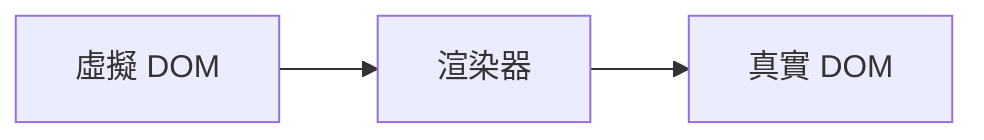

# 第一章：權衡的藝術

---

## 命令式 vs 聲明式

- 命令式：關注過程，直接操作 DOM，性能上限高，心智負擔與維護成本高
- 聲明式：關注結果（模板/JSX），由框架計算最小變更，易維護但有額外開銷
- 重點：把「過程心智負擔」轉移給框架，讓開發者只關注結果

---

<div h="80%" flex="~ col gap-y-8">

<div>

## jQuery

```js
// jQuery
$('#app')
  .text('hello world')
  .on('click', () => alert('ok'))
```

</div>

<div>

## Vue

```vue
<!-- Vue -->
<div id="app" @click="() => alert('ok')">{{ msg }}</div>
```

</div>

</div>

---

## 性能與可維護性的權衡

- 結論：聲明式代碼的性能不優於命令式代碼
- 更新成本模型：

$$
\text{命令式更新消耗} = A
$$

$$
\text{聲明式更新消耗} = B + A
$$

---
layout: fact
---

## 為什麼 Vue 要選擇聲明式 ?

讓使用者描述「結果」，框架負責「過程」，降低心智負擔

---

## 三種模式的定位

<div class="grid grid-cols-1 gap-4 mt-3">

<div class="bg-gray-800/30 p-2 rounded">
<h3 class="text-sm font-bold mb-0">原生 JavaScript</h3>
<p class="text-gray-300 text-xs mb-0">直接 DOM API 操作（createElement/append 等）</p>
<p class="text-xs text-gray-400">心智負擔最高、維護性最低，但性能上限最高</p>
</div>

<div class="bg-gray-800/30 p-2 rounded">
<h3 class="text-sm font-bold mb-0">innerHTML</h3>
<p class="text-gray-300 text-xs mb-0">渲染 HTML 字串，更新時傾向銷毀重建</p>
<p class="text-xs text-gray-400">心智負擔較低、維護性中等，性能與模板大小高度相關</p>
</div>

<div class="bg-gray-800/30 p-2 rounded">
<h3 class="text-sm font-bold mb-0">虛擬 DOM</h3>
<p class="text-gray-300 text-xs mb-0">先建立 JS 物件（VNode）+ Diff，僅做必要 DOM 更新</p>
<p class="text-xs text-gray-400">心智負擔中等、維護性中高，性能依變更規模而變</p>
</div>

</div>

---

## 創建 vs 更新

- 創建：VDOM 與 innerHTML 差距不大
- 更新：VDOM 優勢在「找差異並最小化更新」
- 目標：在不犧牲可維護性的前提下把性能差距壓到最小

---

## 執行時與編譯時：三種模式

- 純執行時（Runtime-only）：直接以資料結構驅動渲染與更新；靈活、可動態，但運行時計算較多
- 執行時 + 編譯時（Vue 3）：保留靈活性，並在編譯期做靜態提升、PatchFlags、Block Tree 等優化
- 純編譯時（Compile-only）：將模板編譯成命令式代碼，運行時最小；對動態能力與邊界條件需取捨

---
layout: center
---

# 第二章：框架設計的核心要素

---

## 框架的核心

- DX

- Bundle Size

- Tree Shaking

- 構建產物

- TS 型別支持

---

## 錯誤訊息

<div h="80%" grid="~ place-items-center">
  
</div>

---

## 格式化輸出

<div h="80%" grid="~ place-items-center">
  
</div>

---

## Chrome 工具列

<div h="80%" grid="~ place-items-center">
  
</div>

---

# isDev

<div h="80%" flex="~ col justify-center items-center gap-y-4">

```ts
if (__DEV__) {
  warn(
    `Set operation on key "${String(key)}" failed: target is readonly.`,
    target,
  )
}
```

> Make sure to put dev-only code in __DEV__ branches so they are tree-shakable.
>
> 請務必將僅限開發的程式碼放在 __DEV__ 分支中，以便它們可樹狀結構可搖動。

</div>

---

# Tree Shaking

<div h="80%" flex="~ col justify-center items-center gap-y-4">


</div>

---
layout: iframe
url: https://rollupjs.org/repl/?version=4.45.1&shareable=JTdCJTIyZXhhbXBsZSUyMiUzQW51bGwlMkMlMjJtb2R1bGVzJTIyJTNBJTVCJTdCJTIyY29kZSUyMiUzQSUyMmltcG9ydCUyMCU3QiUyMGNyZWF0ZUElMkMlMjBjcmVhdGVCJTJDJTIwY3JlYXRlQyUyMCU3RCUyMGZyb20lMjAnLiUyRmxpYi5qcyclM0IlNUNuJTVDbmNvbnN0JTIwdW51c2VkQSUyMCUzRCUyMGNyZWF0ZUEoKSU1Q25jb25zdCUyMHVudXNlZEIlMjAlM0QlMjAlMkYqJTQwX19QVVJFX18qJTJGJTIwY3JlYXRlQigpJTVDbmNvbnN0JTIwdW51c2VkQyUyMCUzRCUyMGNyZWF0ZUMoKSUyMiUyQyUyMmlzRW50cnklMjIlM0F0cnVlJTJDJTIybmFtZSUyMiUzQSUyMm1haW4uanMlMjIlN0QlMkMlN0IlMjJjb2RlJTIyJTNBJTIyZXhwb3J0JTIwZnVuY3Rpb24lMjBjcmVhdGVBKCklMjAlN0IlNUNuJTIwJTIwY29uc29sZS5sb2coJ3NpZGUlMjBlZmZlY3QnKSU1Q24lMjAlMjByZXR1cm4lMjAlN0IlN0QlNUNuJTdEJTVDbiU1Q25leHBvcnQlMjBmdW5jdGlvbiUyMGNyZWF0ZUIoKSUyMCU3QiU1Q24lMjAlMjBjb25zb2xlLmxvZygnc2lkZSUyMGVmZmVjdCcpJTVDbiUyMCUyMHJldHVybiUyMCU3QiU3RCU1Q24lN0QlNUNuJTVDbiUyRiolMjAlMjNfX05PX1NJREVfRUZGRUNUU19fJTIwKiUyRiU1Q25leHBvcnQlMjBmdW5jdGlvbiUyMGNyZWF0ZUMoKSUyMCU3QiU1Q24lMjAlMjBjb25zb2xlLmxvZygnc2lkZSUyMGVmZmVjdCcpJTVDbiUyMCUyMHJldHVybiUyMCU3QiU3RCU1Q24lN0QlMjIlMkMlMjJpc0VudHJ5JTIyJTNBZmFsc2UlMkMlMjJuYW1lJTIyJTNBJTIybGliLmpzJTIyJTdEJTVEJTJDJTIyb3B0aW9ucyUyMiUzQSU3QiUyMm91dHB1dCUyMiUzQSU3QiUyMmZvcm1hdCUyMiUzQSUyMmVzJTIyJTdEJTJDJTIydHJlZXNoYWtlJTIyJTNBdHJ1ZSU3RCU3RA==
scale: 0.6
---

---

# 構建產物

- IIFE (CDN, unpkg)
- ESM (捆綁器)
- CJS (Node SSR)


---

# TS 型別支持

```ts {monaco} {height: '150px'}
import { ref } from 'vue'

// 自動判斷為 number
const a = ref(1)

a.value = '1' // error
```

---
layout: center
---

# 第三章：Vue.js 3 的設計思路

---

<v-clicks>

<div>

## DOM 描述方式

物件描述

```ts
const title = {
  tag: 'h1',
  props: {
    onClick: handler
  },
  children: [
    { tag: 'span' }
  ]
}
```

</div>

<div>

Vue.js 模板 (hyperscript)


````md magic-move {at:3}
```vue
<h1 @click="handler"><span></span></h1>
```

```ts
import { h } from 'vue'

export default {
  render() {
    return h('h1', { onClick: handler }, [h('span')])
  }
}
```
````

</div>

</v-clicks>

---
layout: fact
---

## JavaScript 物件來描述 UI = 虛擬 DOM

---

## 渲染器



---

## 渲染函式

<div h-full>

<div pb-6 h-full of-auto>

```ts
function renderer(vnode, container) {
  // 使用 vnode.tag 作為標籤名稱創建 DOM 元素
  const el = document.createElement(vnode.tag)
  // 遍歷 vnode.props，將屬性、事件添加到 DOM 元素
  for (const key in vnode.props) {
    if (/^on/.test(key)) {
      // 如果 key 以 on 開頭，說明它是事件
      el.addEventListener(
        key.substr(2).toLowerCase(), // 事件名稱 onClick ---> click
        vnode.props[key] // 事件處理函數
      )
    }
  }

  // 處理 children
  if (typeof vnode.children === 'string') {
    // 如果 children 是字串，說明它是元素的文本子節點
    el.appendChild(document.createTextNode(vnode.children))
  } else if (Array.isArray(vnode.children)) {
    // 遞歸地調用 renderer 函數渲染子節點，使用當前元素 el 作為掛載點
    vnode.children.forEach(child => renderer(child, el))
  }

  // 將元素添加到掛載點下
  container.appendChild(el)
}
```

</div>

</div>

---

## 組件的本質

```ts
const MyComponent = {
  render() {
    return {
      tag: 'div',
      props: {
        onClick: () => alert('hello')
      },
      children: 'click me'
    }
  }
}
```

---

## mountElement

```ts
function mountElement(vnode, container) {
  // 使用 vnode.tag 作為標籤名稱創建 DOM 元素
  const el = document.createElement(vnode.tag)
  // 遍歷 vnode.props，將屬性、事件添加到 DOM 元素
  for (const key in vnode.props) {
    if (/^on/.test(key)) {
      // 如果 key 以字串 on 開頭，說明它是事件
      el.addEventListener(
        key.substr(2).toLowerCase(), // 事件名稱 onClick ---> click
        vnode.props[key] // 事件處理函數
      )
    }
  }
  // 處理 children
  if (typeof vnode.children === 'string') {
    // 如果 children 是字串，說明它是元素的文本子節點
    el.appendChild(document.createTextNode(vnode.children))
  } else if (Array.isArray(vnode.children)) {
    // 遞迴地調用 renderer 函數渲染子節點，使用當前元素 el 作為掛載點
    vnode.children.forEach(child => renderer(child, el))
  }
  // 將元素添加到掛載點下
  container.appendChild(el)
}
```

---

## 模板的工作原理

````md magic-move {at:2}
```vue 
<template>
  <div @click="handler">click me</div>
</template>
```

```js
import { h } from 'vue'
export function render() {
  return h('div', { onClick: handler }, 'click me')
}
```
````

---

## Vue.js 是各模組組成的有機整體

<div class="grid grid-cols-1 gap-4 mt-6">

<div class="bg-gray-800/30 p-4 rounded">
<h3 class="text-sm font-bold mb-2">編譯器</h3>
<p class="text-gray-300 text-xs mb-1">分析模板，識別靜態與動態內容</p>
<p class="text-xs text-gray-400">產生 patchFlags 等優化資訊</p>
</div>

<div class="bg-gray-800/30 p-4 rounded">
<h3 class="text-sm font-bold mb-2">渲染器</h3>
<p class="text-gray-300 text-xs mb-1">接收編譯器資訊，最小化更新範圍</p>
<p class="text-xs text-gray-400">只更新真正變化的部分</p>
</div>

</div>

--- 

# 參考資料

- [Rollup 的 Tree Shaking](https://cn.rollupjs.org/configuration-options/#pure)
- [原來程式碼打包也有這麼多眉角 - 淺談 Tree Shaking 機制](https://medium.com/starbugs/%E5%8E%9F%E4%BE%86%E7%A8%8B%E5%BC%8F%E7%A2%BC%E6%89%93%E5%8C%85%E4%B9%9F%E6%9C%89%E9%80%99%E9%BA%BC%E5%A4%9A%E7%9C%89%E8%A7%92-%E6%B7%BA%E8%AB%87-tree-shaking-%E6%A9%9F%E5%88%B6-8375d35d87b2)
