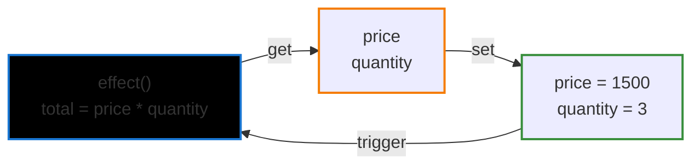
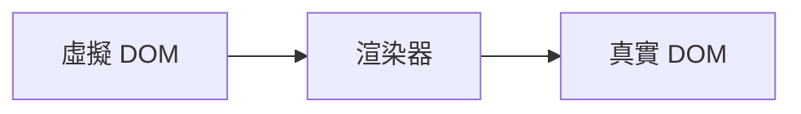

# 第四章：響應式系統的作用和實作

---

## 4.1 響應式資料的基礎-認識副作用(effect)

副作用 VS 純函式

純函式(pure function)的意義:

- 相同輸入而有穩定的相同輸出
- 引用的透明性(沒有干擾或設定外部變數作用)

```js
const add(x: number, y: number) => x + y;

console.log(add(1, 2)) // 3
console.log(add(1, 2)) // 3

```

副作用(side effect): 引用的不透明性+不穩定輸出

```js
let a = 1;

const foo(x: number) => {
  a++; // 副作用
  return x + a;
}
console.log(foo(1)) // 3
console.log(foo(1)) // 4
```

---

## 4.1 響應式系統的雛型

<div h="80%" flex="~ col gap-y-8">

<div>

我們希望更改價格或數量時，total 價格可以響應地自動正確變化

```js
let price = 1000;
let quantity = 2;
let total = price * quantity;

const effect = () => {
  total = price * quantity;
};
```

目前需要在資料變化時手動執行effect

```js
price = 1500;
effect();
console.log(total); //3000
```

</div>
</div>

---

## 4.2 響應式資料實作

- 執行副作用 (effect) 時，知道有那些依賴資料需些讀取 (get)
- 修改(set) 依賴資料時，同時又要通知相關的副作用重新執行 (trigger)

我們需要對物件屬性 `自動攔截` 上述這些操作，讓響應式這個行為能夠自然地執行




---

## 4.2 響應式桶子(bucket)

<div style="display:grid; grid-template-columns: 1fr 1fr; gap:16px; align-items:start;">

  <div>
    <ul style="margin:0; padding-left:1.2em; text-align:start">
      <li>為了收集紀錄這些副作用 (effect)，我們需要一個桶子 (bucket) 來做儲存</li>
      <li>Vue 3 利用了 
        <spans style="color:orange">JS ES6 Proxy</spans> 
      特性來達成對於資料讀取和變動的自動攔截</li>
    </ul>
  </div>

  <div style="text-align:center;">
    
  </div>
</div>

---

## 4.2 Vue 2 ES5 defineProperty

- 如果一個物件有新的屬性，會需要遍例查察找
- 陣列的新增修改也比較麻煩，需要特殊處理 ```Vue.set()```

<div style="display:grid; grid-template-columns: 1fr 1fr; gap:16px; align-items:start">

```js
class SimpleReactive {
  constructor(data) {
    this.data = {};
    this.effects = new Set();
    this.currentEffect = null;
    
    // 使用 Object.defineProperty 為每個屬性創建響應式
    this.makeReactive(data);
  }
  makeReactive(obj) {
    Object.keys(obj).forEach(key => {
      let value = obj[key];
      
      Object.defineProperty(this.data, key, {
        get: () => {
          // getter: 收集依賴
          if (this.currentEffect) {
            this.effects.add(this.currentEffect);
            console.log(`📖 get ${key}: ${value} (收集依賴)`);
          }
          return value;
        },
        
      });
    });
  }
  
}
```
```js
   set: (newValue) => {
          // setter: 觸發更新
          if (value !== newValue) {
            console.log(`✏️ set ${key}: ${value} -> ${newValue}`);
            value = newValue;
            
            // 觸發所有相關的 effects
            this.effects.forEach(effect => {
              console.log(`🚀 觸發 effect 重新執行`);
              effect();
            });
          }
        }
```
</div>

---

## 4.2 Vue 3 ES6 Proxy 代理攔截

- ```target``` 原始物件
- ```Proxy(target,handler)```,我們可以利用第二個參數 handler 設定攔截邏輯
- 這邊可以先注意 ```get```取得的值其實是```Reflect```返回 Proxy 物件，避免後續需要讀取操作時失去攔截作用

```js
// 原始數據
const data = { price: 1000, quantity: 5 };
const bucket: Set<Function> = new Set();
const obj = new Proxy(data, {
  // 攔截讀取 get
  get(target: any, key: string, receiver) {
    // 副作用收集
    bucket.add(effect);
    // 返回要get的属性值
    return Reflect.get(target,key,receiver)
  },
  set(target: any, key: string, value: any) {
    // 針對資料屬性賦值
    target[key] = value;
    // 觸發設置的副作用
    bucket.forEach(fn => fn());
    // 属性值設置成功後返回 true
    return true;
  }
})


```

---

## 4.3 設計一個完善的響應系統

- 不過細細觀看上一段程式碼，會發現 ```讀取動作 get ，effect 從哪裡來```
- 我們需要設置一個全局的 ```activeEffect```，紀錄當前執行的 ```effect```
- 當我們從```桶子(bucket)```取出effect執行時，依序替換```activeEffect```

<div style="display:grid; grid-template-columns: 1fr 1fr; gap:16px; align-items:start">

```js
const data = { price: 1000, quantity: 5 };
const bucket: Set<Function> = new Set();

// 設定一個全局的當前的執行的activeEffect
let activeEffect

const obj = new Proxy(data, {
  // 攔截讀取 get
  get(target: any, key: string, receiver) {
    // 副作用收集
    bucket.add(activeEffect);
    // 返回要get的属性值
    return Reflect.get(target,key,receiver)
  },
  set(target: any, key: string, newVal) {
    target[key] = newVal
    bucket.forEach(fn=>fn()) // 這裡是取出effect一一執行
  }
```

```js
function effect(fn) {
  activeEffect = fn
  fn()
}

```
</div>

---

## 4.1~4.3 Recap 響應式系統基礎總結

- 響應式系統基礎建立在 ```get(讀取) --> bucket.add(註冊)-->set(賦值)-->取出副作用(effect)-->觸發更新(trigger)```
- 有```讀取(getter)```才會註冊副作用，這也是為什麼```watch```設計成getter
- 兩個資料建立副作用關係，依賴於 set 修改邏輯中， ```effect```是否有讀取其他變數

只有讀取才會建立依賴。

只有修改才會觸發依賴。

如果 effect 只會「修改」而不「讀取」，那它根本不會進入 bucket，也就不會被響應系統追蹤。
<div style="display:grid; grid-template-columns: 1fr 1fr; gap:16px; align-items:start">
```js
watch(
  () => state.a,
  (newVal) => {
    state.b = newVal + 1
  }
)
```

```js
watch(
  () => state.a,
  () => {
    state.b = state.a + 1
  }
)
```
</div>

---

### 響應式流程 trigger-track 圖解


---

## 4.3 響應式系統資料樹狀圖建立

- 目前我們的副作用(effect)紀錄管理，bucket 僅能對```一個物件其中單一屬性```紀錄並取出執行
- 需要針對不同 ```物件(target)```、```屬性(key)```和```副作用(effect)```，利用key-value資料結構管理

<div style="display:grid; grid-template-columns: 1fr 1fr; gap:16px; align-items:start">
```js

const data = {
  price: 1000,
  quantity: 1
}

let total = 0

// 副作用
const effect = ()=> {
  total = price * quantity
}

// 如果price 和 quantity 這兩筆資料有各自的獨立effect?
const effectPrice = ()=>{
  console.log('品項價格',data.price)
}

const effectQuantity = ()=> {
  console.log('數量',data.quantity)
}

```
```js
const bucket: Set<Function> = new Set();

// 設定一個全局的當前的執行的activeEffect
let activeEffect

const obj = new Proxy(data, {
  // 攔截讀取 get
  get(target: any, key: string, receiver) {
    // 副作用收集
    bucket.add(activeEffect);
    // 返回要get的属性值
    return Reflect.get(target,key,receiver)
  },
  set(target: any, key: string, newVal) {
    target[key] = newVal
    bucket.forEach(fn=>fn()) // 這裡是取出effect一一執行
  }

```
</div>


---

## 4.3 WeakMap - Map - Set 響應式副作用資料表結構
參考: https://ithelp.ithome.com.tw/articles/10264271?sc=rss.iron
<div style="max-width:560px; margin: 0 auto;">
  
</div>

---

## 4.3 Proxy攔截器中將副作用註冊和取出

- 可以設計```註冊(track)```和```觸發(trigger)```，作為響應資料間依賴關係的```訂閱(subscribe)```和```通知(notify)```

<div style="display:grid; grid-template-columns: 1fr 1fr; gap:16px; align-items:start">
```js
// 定义 track 方法收集副作用函数
const track = (target: any, key: string) => {
  // 当前没有正在执行的副作用函数，直接返回
  if (!activeEffect) return;
  // 取出目标对象指向的 Map
  let depsMap = bucket.get(target);
  if (!depsMap) {
    // 如果不存在，就创建一个新的 Map
    depsMap = new Map()
    // 将新的 Map 添加到 「桶」中
    bucket.set(target, depsMap);
  }
  // 根据当前 key 取出 副作用函数的集合，她是一个 Set
  let deps = depsMap.get(key);
  if (!deps) {
    // 如果不存在就创建一个新的 Set
    deps = new Set();
    // 将新的 Set 添加到 Map 中去
    depsMap.set(key, deps);
  }
  // 收集副作用函数
  deps.add(activeEffect);
}
```
```js
// 定义trigger方法用来触发副作用函数的执行
const trigger = (target: any, key: string) => {
  // 从「桶」中取出当前对象绑定的 Map
  const depsMap = bucket.get(target);
  if (depsMap) {
    // 根据 key 取出与之绑定的副作用函数集合
    const effects = depsMap.get(key);
    // 遍历并执行这些副作用函数
    effects && effects.forEach(fn => fn());
  }
}
```
</div>
---

## 4.3 重構完 track/trigger
https://vuejs.org/guide/extras/reactivity-in-depth.html#how-reactivity-works-in-vue

- 記得 Vue 整個應用上還管理著 ```bucket(副作用桶子)```和```activeEffect(目前執行的effect)```
- 每一個響應式資料實體(ref/reactive)，透過 ```track```和```trigger``` 和副作用紀錄進行連結

<div style="display:grid; grid-template-columns: 1fr 1fr; gap:16px; align-items:start">
```js
function reactive(obj) {
  return new Proxy(obj, {
    get(target, key) {
      track(target, key)
      return target[key]
    },
    set(target, key, value) {
      target[key] = value
      trigger(target, key)
    }
  })
}
```
```js
function ref(value) {
  const refObject = {
    get value() {
      track(refObject, 'value')
      return value
    },
    set value(newValue) {
      value = newValue
      trigger(refObject, 'value')
    }
  }
  return refObject
}
```
</div>

---

## 4.4 分支管理和clean up

- 這章主要是闡述，在 ```副作用effect``` 執行中因為透過 ```讀取``` 去紀錄資料屬性和相關副作用關係
- 這段副作用關係間紀錄會```一成不變```，還是有```動態改變```可能性? 


```js
const data = {
  ok: true,
  text: 'hello'
}
const obj = new Proxy(data,{/** */})
// effect
effect( function effectFn() {
   document.body.innerText = obj.ok? obj.text : 'not'
})
// 有兩種effect 可能性
// 根據 obj.ok 結果 effect 紀錄表要有所變化
effect( function effectFnA() {
   document.body.innerText = 'not'
})

effect( function effectFnB() {
   document.body.innerText = obj.text 
})

```


---

## 4.4 透過建立effect dep 依賴屬性key的關係 (重要)
- 每個物件屬性 dep(Set)，裡面除了紀錄 ```effect```，也為```effect```增加```dep```
- ```effect.dep```記錄著當下註冊的所有```dep set```的實體鍵結關係
- 先做清除動作(clean up)， 再讓```effect dep```去刪除會不必要的 ```dep set``` effect

<div style="display:grid; grid-template-columns: 1fr 1fr; gap:16px; align-items:start">
```
target ──> (key) ──> dep(Set)
                       ├─ effectA  <──┐
                       ├─ effectB      │
                       └─ effectC      │
                                       │
effectA.deps: [depX, depY, dep(↑這個)] ┘  // 反向記錄：effectA 被哪些 dep 收集
```

```js
function track(target: object, key: PropertyKey) {
  if (!activeEffect) return
  // 1) 取到該 key 的 dep(Set<EffectFunction>)
  let depsMap = bucket.get(target)
  if (!depsMap) bucket.set(target, (depsMap = new Map()))
  let dep = depsMap.get(key)
  if (!dep) depsMap.set(key, (dep = new Set<EffectFunction>()))
  // 2) 把 activeEffect 放進 dep
  if (!dep.has(activeEffect)) {
    dep.add(activeEffect)
    // 3) 反向也記錄：這個 effect 被哪個 dep 收集
    activeEffect.deps.push(dep)
  }
}

```
</div>


---

## 4.4 透過clean up 和 effectFn 進行比對
- 因為 effect 的執行內容不是固定的，可以想像在每個 ```effect 內去做動態追蹤處理```
- 在 effect 重跑前，先把自己從所有不再需要的 dep(Set) 裡刪掉
- 下回資料更新 ```setter副作用觸發,同一 dep(Set) key值內就會移除掉不必要副作用(effect)```
- clean up 內處理的作用，其實是對 dep set 進行移除 effect 動作
<div style="display:grid; grid-template-columns: 1fr 1fr; gap:16px; align-items:start">
```js
let activeEffect
function effect(fn) {
  const effectFn() = ()=>{
    // 呼叫清理動作
    cleanup(effectFn)
    activeEffect = effectFn
    fn()
  }
  effectFn.deps = []
  effectFn
}
```

```js
function cleanup(effectFn) {
  for (let i=0; i<effectFn.deps.length; i++) {
    const deps = effectFn.deps[i]
    // 移除目前執行的effect
    deps.delete(effectFn)
  }
  effect.deps.length = 0
}
```
</div>

---

## 4.4 Recap - 透過effect dep 動態清除副作用
- 簡單來說，動態分支清理透過 effect dep 來動態調整每次執行的 set 依賴集合

https://juejin.cn/post/7170135046945243166


---

# TS 型別支持

```ts {monaco} {height: '150px'}
import { ref } from "vue";

// 自動判斷為 number
const a = ref(1);

a.value = "1"; // error
```

---

## layout: center

# 第三章：Vue.js 3 的設計思路

---

<v-clicks>

<div>

## DOM 描述方式

物件描述

```ts
const title = {
  tag: "h1",
  props: {
    onClick: handler,
  },
  children: [{ tag: "span" }],
};
```

</div>

<div>

Vue.js 模板 (hyperscript)

````md magic-move {at:3}
```vue
<h1 @click="handler"><span></span></h1>
```

```ts
import { h } from "vue";

export default {
  render() {
    return h("h1", { onClick: handler }, [h("span")]);
  },
};
```
````

</div>

</v-clicks>

---

## layout: fact

## JavaScript 物件來描述 UI = 虛擬 DOM

---

## 渲染器



---

## 渲染函式

<div h-full>

<div pb-6 h-full of-auto>

```ts
function renderer(vnode, container) {
  // 使用 vnode.tag 作為標籤名稱創建 DOM 元素
  const el = document.createElement(vnode.tag);
  // 遍歷 vnode.props，將屬性、事件添加到 DOM 元素
  for (const key in vnode.props) {
    if (/^on/.test(key)) {
      // 如果 key 以 on 開頭，說明它是事件
      el.addEventListener(
        key.substr(2).toLowerCase(), // 事件名稱 onClick ---> click
        vnode.props[key] // 事件處理函數
      );
    }
  }

  // 處理 children
  if (typeof vnode.children === "string") {
    // 如果 children 是字串，說明它是元素的文本子節點
    el.appendChild(document.createTextNode(vnode.children));
  } else if (Array.isArray(vnode.children)) {
    // 遞歸地調用 renderer 函數渲染子節點，使用當前元素 el 作為掛載點
    vnode.children.forEach((child) => renderer(child, el));
  }

  // 將元素添加到掛載點下
  container.appendChild(el);
}
```

</div>

</div>

---

## 組件的本質

```ts
const MyComponent = {
  render() {
    return {
      tag: "div",
      props: {
        onClick: () => alert("hello"),
      },
      children: "click me",
    };
  },
};
```

---

## mountElement

```ts
function mountElement(vnode, container) {
  // 使用 vnode.tag 作為標籤名稱創建 DOM 元素
  const el = document.createElement(vnode.tag);
  // 遍歷 vnode.props，將屬性、事件添加到 DOM 元素
  for (const key in vnode.props) {
    if (/^on/.test(key)) {
      // 如果 key 以字串 on 開頭，說明它是事件
      el.addEventListener(
        key.substr(2).toLowerCase(), // 事件名稱 onClick ---> click
        vnode.props[key] // 事件處理函數
      );
    }
  }
  // 處理 children
  if (typeof vnode.children === "string") {
    // 如果 children 是字串，說明它是元素的文本子節點
    el.appendChild(document.createTextNode(vnode.children));
  } else if (Array.isArray(vnode.children)) {
    // 遞迴地調用 renderer 函數渲染子節點，使用當前元素 el 作為掛載點
    vnode.children.forEach((child) => renderer(child, el));
  }
  // 將元素添加到掛載點下
  container.appendChild(el);
}
```

---

## 模板的工作原理

````md magic-move {at:2}
```vue
<template>
  <div @click="handler">click me</div>
</template>
```

```js
import { h } from "vue";
export function render() {
  return h("div", { onClick: handler }, "click me");
}
```
````

---

## Vue.js 是各模組組成的有機整體

<div class="grid grid-cols-1 gap-4 mt-6">

<div class="bg-gray-800/30 p-4 rounded">
<h3 class="text-sm font-bold mb-2">編譯器</h3>
<p class="text-gray-300 text-xs mb-1">分析模板，識別靜態與動態內容</p>
<p class="text-xs text-gray-400">產生 patchFlags 等優化資訊</p>
</div>

<div class="bg-gray-800/30 p-4 rounded">
<h3 class="text-sm font-bold mb-2">渲染器</h3>
<p class="text-gray-300 text-xs mb-1">接收編譯器資訊，最小化更新範圍</p>
<p class="text-xs text-gray-400">只更新真正變化的部分</p>
</div>

</div>

---

# 參考資料

- [Rollup 的 Tree Shaking](https://cn.rollupjs.org/configuration-options/#pure)
- [原來程式碼打包也有這麼多眉角 - 淺談 Tree Shaking 機制](https://medium.com/starbugs/%E5%8E%9F%E4%BE%86%E7%A8%8B%E5%BC%8F%E7%A2%BC%E6%89%93%E5%8C%85%E4%B9%9F%E6%9C%89%E9%80%99%E9%BA%BC%E5%A4%9A%E7%9C%89%E8%A7%92-%E6%B7%BA%E8%AB%87-tree-shaking-%E6%A9%9F%E5%88%B6-8375d35d87b2)
