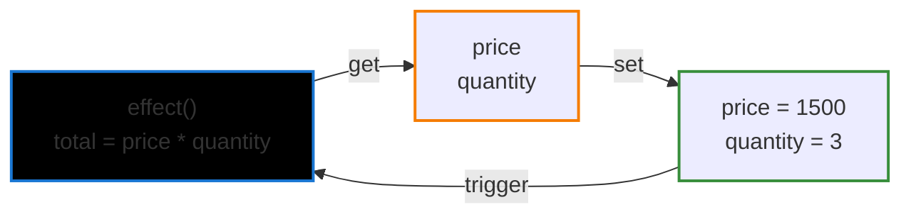

# 第四章：響應式系統的作用和實作

---

## 4.1 響應式資料的基礎-認識副作用(effect)

副作用 VS 純函式

純函式(pure function)的意義:

- 相同輸入而有穩定的相同輸出
- 引用的透明性(沒有干擾或設定外部變數作用)

```js
const add(x: number, y: number) => x + y;

console.log(add(1, 2)) // 3
console.log(add(1, 2)) // 3

```

副作用(side effect): 引用的不透明性+不穩定輸出

```js
let a = 1;

const foo(x: number) => {
  a++; // 副作用
  return x + a;
}
console.log(foo(1)) // 3
console.log(foo(1)) // 4
```

---

## 4.1 響應式系統的雛型

<div h="80%" flex="~ col gap-y-8">

<div>

我們希望更改價格或數量時，total 價格可以響應地自動正確變化

```js
let price = 1000;
let quantity = 2;
let total = price * quantity;

const effect = () => {
  total = price * quantity;
};
```

目前需要在資料變化時手動執行effect

```js
price = 1500;
effect();
console.log(total); //3000
```

</div>
</div>

---

## 4.2 響應式資料實作

- 執行副作用 (effect) 時，知道有那些依賴資料需些讀取 (get)
- 修改(set) 依賴資料時，同時又要通知相關的副作用重新執行 (trigger)

我們需要對物件屬性 `自動攔截` 上述這些操作，讓響應式這個行為能夠自然地執行




---

## 4.2 響應式桶子(bucket)

<div style="display:grid; grid-template-columns: 1fr 1fr; gap:16px; align-items:start;">

  <div>
    <ul style="margin:0; padding-left:1.2em; text-align:start">
      <li>為了收集紀錄這些副作用 (effect)，我們需要一個桶子 (bucket) 來做儲存</li>
      <li>Vue 3 利用了 
        <spans style="color:orange">JS ES6 Proxy</spans> 
      特性來達成對於資料讀取和變動的自動攔截</li>
    </ul>
  </div>

  <div style="text-align:center;">
    
  </div>
</div>

---

## 4.2 Vue 2 ES5 defineProperty

- 如果一個物件有新的屬性，會需要遍例查察找
- 陣列的新增修改也比較麻煩，需要特殊處理 ```Vue.set()```

<div style="display:grid; grid-template-columns: 1fr 1fr; gap:16px; align-items:start">

```js
class SimpleReactive {
  constructor(data) {
    this.data = {};
    this.effects = new Set();
    this.currentEffect = null;
    
    // 使用 Object.defineProperty 為每個屬性創建響應式
    this.makeReactive(data);
  }
  makeReactive(obj) {
    Object.keys(obj).forEach(key => {
      let value = obj[key];
      
      Object.defineProperty(this.data, key, {
        get: () => {
          // getter: 收集依賴
          if (this.currentEffect) {
            this.effects.add(this.currentEffect);
            console.log(`📖 get ${key}: ${value} (收集依賴)`);
          }
          return value;
        },
        
      });
    });
  }
  
}
```
```js
   set: (newValue) => {
          // setter: 觸發更新
          if (value !== newValue) {
            console.log(`✏️ set ${key}: ${value} -> ${newValue}`);
            value = newValue;
            
            // 觸發所有相關的 effects
            this.effects.forEach(effect => {
              console.log(`🚀 觸發 effect 重新執行`);
              effect();
            });
          }
        }
```
</div>

---

## 4.2 Vue 3 ES6 Proxy 代理攔截

- ```target``` 原始物件
- ```Proxy(target,handler)```,我們可以利用第二個參數 handler 設定攔截邏輯
- 這邊可以先注意 ```get```取得的值其實是```Reflect```返回 Proxy 物件，避免後續需要讀取操作時失去攔截作用

```js
// 原始數據
const data = { price: 1000, quantity: 5 };
const bucket: Set<Function> = new Set();
const obj = new Proxy(data, {
  // 攔截讀取 get
  get(target: any, key: string, receiver) {
    // 副作用收集
    bucket.add(effect);
    // 返回要get的属性值
    return Reflect.get(target,key,receiver)
  },
  set(target: any, key: string, value: any) {
    // 針對資料屬性賦值
    target[key] = value;
    // 觸發設置的副作用
    bucket.forEach(fn => fn());
    // 属性值設置成功後返回 true
    return true;
  }
})


```

---

## 4.3 設計一個完善的響應系統

- 不過細細觀看上一段程式碼，會發現 ```讀取動作 get ，effect 從哪裡來```
- 我們需要設置一個全局的 ```activeEffect```，紀錄當前執行的 ```effect```
- 當我們從```桶子(bucket)```取出effect執行時，依序替換```activeEffect```

<div style="display:grid; grid-template-columns: 1fr 1fr; gap:16px; align-items:start">

```js
const data = { price: 1000, quantity: 5 };
const bucket: Set<Function> = new Set();

// 設定一個全局的當前的執行的activeEffect
let activeEffect

const obj = new Proxy(data, {
  // 攔截讀取 get
  get(target: any, key: string, receiver) {
    // 副作用收集
    bucket.add(activeEffect);
    // 返回要get的属性值
    return Reflect.get(target,key,receiver)
  },
  set(target: any, key: string, newVal) {
    target[key] = newVal
    bucket.forEach(fn=>fn()) // 這裡是取出effect一一執行
  }
```

```js
function effect(fn) {
  activeEffect = fn
  fn()
}

```
</div>

---

## 4.1~4.3 Recap 響應式系統基礎總結

- 響應式系統基礎建立在 ```get(讀取) --> bucket.add(註冊)-->set(賦值)-->取出副作用(effect)-->觸發更新(trigger)```
- 有```讀取(getter)```才會註冊副作用，這也是為什麼```watch```設計成getter
- 兩個資料建立副作用關係，依賴於 set 修改邏輯中， ```effect```是否有讀取其他變數

只有讀取才會建立依賴。

只有修改才會觸發依賴。

如果 effect 只會「修改」而不「讀取」，那它根本不會進入 bucket，也就不會被響應系統追蹤。
<div style="display:grid; grid-template-columns: 1fr 1fr; gap:16px; align-items:start">
```js
watch(
  () => state.a,
  (newVal) => {
    state.b = newVal + 1
  }
)
```

```js
watch(
  () => state.a,
  () => {
    state.b = state.a + 1
  }
)
```
</div>

---

### 響應式流程 trigger-track 圖解


---

## 4.3 響應式系統資料樹狀圖建立

- 目前我們的副作用(effect)紀錄管理，bucket 僅能對```一個物件其中單一屬性```紀錄並取出執行
- 需要針對不同 ```物件(target)```、```屬性(key)```和```副作用(effect)```，利用key-value資料結構管理

<div style="display:grid; grid-template-columns: 1fr 1fr; gap:16px; align-items:start">
```js

const data = {
  price: 1000,
  quantity: 1
}

let total = 0

// 副作用
const effect = ()=> {
  total = price * quantity
}

// 如果price 和 quantity 這兩筆資料有各自的獨立effect?
const effectPrice = ()=>{
  console.log('品項價格',data.price)
}

const effectQuantity = ()=> {
  console.log('數量',data.quantity)
}

```
```js
const bucket: Set<Function> = new Set();

// 設定一個全局的當前的執行的activeEffect
let activeEffect

const obj = new Proxy(data, {
  // 攔截讀取 get
  get(target: any, key: string, receiver) {
    // 副作用收集
    bucket.add(activeEffect);
    // 返回要get的属性值
    return Reflect.get(target,key,receiver)
  },
  set(target: any, key: string, newVal) {
    target[key] = newVal
    bucket.forEach(fn=>fn()) // 這裡是取出effect一一執行
  }

```
</div>


---

## 4.3 WeakMap - Map - Set 響應式副作用資料表結構
參考: https://ithelp.ithome.com.tw/articles/10264271?sc=rss.iron
<div style="max-width:560px; margin: 0 auto;">
  
</div>

---

## 4.3 Proxy攔截器中將副作用註冊和取出

- 可以設計```註冊(track)```和```觸發(trigger)```，作為響應資料間依賴關係的```訂閱(subscribe)```和```通知(notify)```

<div style="display:grid; grid-template-columns: 1fr 1fr; gap:16px; align-items:start">
```js
// 定义 track 方法收集副作用函数
const track = (target: any, key: string) => {
  // 当前没有正在执行的副作用函数，直接返回
  if (!activeEffect) return;
  // 取出目标对象指向的 Map
  let depsMap = bucket.get(target);
  if (!depsMap) {
    // 如果不存在，就创建一个新的 Map
    depsMap = new Map()
    // 将新的 Map 添加到 「桶」中
    bucket.set(target, depsMap);
  }
  // 根据当前 key 取出 副作用函数的集合，她是一个 Set
  let deps = depsMap.get(key);
  if (!deps) {
    // 如果不存在就创建一个新的 Set
    deps = new Set();
    // 将新的 Set 添加到 Map 中去
    depsMap.set(key, deps);
  }
  // 收集副作用函数
  deps.add(activeEffect);
}
```
```js
// 定义trigger方法用来触发副作用函数的执行
const trigger = (target: any, key: string) => {
  // 从「桶」中取出当前对象绑定的 Map
  const depsMap = bucket.get(target);
  if (depsMap) {
    // 根据 key 取出与之绑定的副作用函数集合
    const effects = depsMap.get(key);
    // 遍历并执行这些副作用函数
    effects && effects.forEach(fn => fn());
  }
}
```
</div>
---

## 4.3 重構完 track/trigger
https://vuejs.org/guide/extras/reactivity-in-depth.html#how-reactivity-works-in-vue

- 記得 Vue 整個應用上還管理著 ```bucket(副作用桶子)```和```activeEffect(目前執行的effect)```
- 每一個響應式資料實體(ref/reactive)，透過 ```track```和```trigger``` 和副作用紀錄進行連結

<div style="display:grid; grid-template-columns: 1fr 1fr; gap:16px; align-items:start">
```js
function reactive(obj) {
  return new Proxy(obj, {
    get(target, key) {
      track(target, key)
      return target[key]
    },
    set(target, key, value) {
      target[key] = value
      trigger(target, key)
    }
  })
}
```
```js
function ref(value) {
  const refObject = {
    get value() {
      track(refObject, 'value')
      return value
    },
    set value(newValue) {
      value = newValue
      trigger(refObject, 'value')
    }
  }
  return refObject
}
```
</div>

---

## 4.4 分支管理和clean up

- 這章主要是闡述，在 ```副作用effect``` 執行中因為透過 ```讀取``` 去紀錄資料屬性和相關副作用關係
- 這段副作用關係間紀錄會```一成不變```，還是有```動態改變```可能性? 


```js
const data = {
  ok: true,
  text: 'hello'
}
const obj = new Proxy(data,{/** */})
// effect
effect( function effectFn() {
   document.body.innerText = obj.ok? obj.text : 'not'
})
// 有兩種effect 可能性
// 根據 obj.ok 結果 effect 紀錄表要有所變化
effect( function effectFnA() {
   document.body.innerText = 'not'
})

effect( function effectFnB() {
   document.body.innerText = obj.text 
})

```


---

## 4.4 透過建立effect dep 依賴屬性key的關係 (重要)
- 每個物件屬性 dep(Set)，裡面除了紀錄 ```effect```，也為```effect```增加```dep```
- ```effect.dep```記錄著當下註冊的所有```dep set```的實體鍵結關係
- 先做清除動作(clean up)， 再讓```effect dep```去刪除會不必要的 ```dep set``` effect

<div style="display:grid; grid-template-columns: 1fr 1fr; gap:16px; align-items:start">
```
target ──> (key) ──> dep(Set)
                       ├─ effectA  <──┐
                       ├─ effectB      │
                       └─ effectC      │
                                       │
effectA.deps: [depX, depY, dep(↑這個)] ┘  // 反向記錄：effectA 被哪些 dep 收集
```

```js
function track(target: object, key: PropertyKey) {
  if (!activeEffect) return
  // 1) 取到該 key 的 dep(Set<EffectFunction>)
  let depsMap = bucket.get(target)
  if (!depsMap) bucket.set(target, (depsMap = new Map()))
  let dep = depsMap.get(key)
  if (!dep) depsMap.set(key, (dep = new Set<EffectFunction>()))
  // 2) 把 activeEffect 放進 dep
  if (!dep.has(activeEffect)) {
    dep.add(activeEffect)
    // 3) 反向也記錄：這個 effect 被哪個 dep 收集
    activeEffect.deps.push(dep)
  }
}

```
</div>


---

## 4.4 透過clean up 和 effectFn 進行比對
- 因為 effect 的執行內容不是固定的，可以想像在每個 ```effect 內去做動態追蹤處理```
- 在 effect 重跑前，先把自己從所有不再需要的 dep(Set) 裡刪掉
- 下回資料更新 ```setter副作用觸發,同一 dep(Set) key值內就會移除掉不必要副作用(effect)```
- clean up 內處理的作用，其實是對 dep set 進行移除 effect 動作
<div style="display:grid; grid-template-columns: 1fr 1fr; gap:16px; align-items:start">
```js
let activeEffect
function effect(fn) {
  const effectFn() = ()=>{
    // 呼叫清理動作
    cleanup(effectFn)
    activeEffect = effectFn
    fn()
  }
  effectFn.deps = []
  effectFn
}
```

```js
function cleanup(effectFn) {
  for (let i=0; i<effectFn.deps.length; i++) {
    const deps = effectFn.deps[i]
    // 移除目前執行的effect
    deps.delete(effectFn)
  }
  effect.deps.length = 0
}
```
</div>

---

## 4.4 Recap - 透過effect dep 動態清除副作用
- 簡單來說，動態分支清理透過 effect dep 來動態調整每次執行的 set 依賴集合

https://juejin.cn/post/7170135046945243166

---

## 4.5 巢狀的 effect 與 effect 堆疊
- 為什麼 effect 需要考量```嵌套設計```?
- 每一段元件經過編譯後，都有自己的 ```render function``` 和 ```effectScope```
<div style="display:grid; grid-template-columns: 1fr 1fr; gap:16px; align-items:start">
```js
<template>
  <Foo>
    <Bar />
  </Foo>
</template>

// render function
effect(() => {
  Foo.render();
  effect(() => {
    Bar.render();
  });
});

```

```js
const data = reactive({ a: 1, b: 2 });

let x, y;

const effect2 = () => {
  console.log('run effect2')
  y = data.b;
};

const effect1 = () => {
  console.log('run effect1');
  effect(effect2)
  x = data.a;
}

effect(effect1);

```
</div>

---

## 4.5 巢狀 effect 內 activeEffect 重置
- 在巢狀呼叫不同 effect 時， 最終 ```activeEffect 會以最內層 effect 為主```
- activeEffect 需要重置清理，避免再次呼叫時依賴錯誤，新增 ```effectStack``` 紀錄任務排序
<div style="display:grid; grid-template-columns: 1fr 1fr; gap:16px; align-items:start">
```js

const effect = (fn: Function) => {
  const effectFn = () => {
    cleanup(effectFn);
    // 這裡會以最內層的effect為主
    activeEffect = effectFn;
    fn();
  }
  effectFn.deps = [] as Array<Set<EffectFunction>>;
  effectFn();
}
```
```ts

let activeEffect: EffectFunction | null = null;
// 引入了一个数组，副作用函数栈，用来存储当前在执行中的副作用函数
const effectStack: Array<EffectFunction> = [];
const bucket: WeakMap<any, Map<string, Set<EffectFunction>>> = new WeakMap();

export const effect = (fn: Function) => {
  const effectFn = () => {
    cleanup(effectFn);
    activeEffect = effectFn;
    // 将当前副作用函数压入栈中
    effectStack.push(effectFn);
    fn();
    // 副作用函数执行完之后再将其从栈中弹出
    effectStack.pop();
    // activeEffect 始终指向栈顶
    activeEffect = effectStack[effectStack.length - 1]
  }
  effectFn.deps = [] as Array<Set<EffectFunction>>;
  effectFn();
}

```

</div>

---

## 4.6 避免無限遞迴循環?

- 如果在一個 effect 內發生```讀取(getter)```和```賦值(setter)```，會發生什麼事?


<div style="display:grid; grid-template-columns: 1fr 1fr; gap:16px; align-items:start">

```js
effect(()=>{
  obj.foo = obj.foo + 1 
})

```

```js
watch(data,()=>{
  data.value ++
})
```
</div>

---

## 4.6 避免無限遞迴循環-比較activeEffect

- 排除和自己相同的 effect

```js
const trigger = (target: any, key: string) => {
  const depsMap = bucket.get(target);
  if (depsMap) {
    const effects = depsMap.get(key);
    if (effects) {
      const effectsToRun: Set<EffectFunction> = new Set();
      effects.forEach(fn => {
        // 增加判断
        if (fn !== activeEffect) {
          effectsToRun.add(fn);
        }
      })
      effectsToRun.forEach(fn => fn());
    }
  }
};

```
---
layout: center
---

# 4.7 調度器(scheduler)

---

## 4.7 為什麼需要調度器

- 效能：去重、批次執行，避免重複渲染或計算，能不能在創建 Virtual DOM 前讓資料準備好

- 正確性：控制副作用執行時機，避免死循環或錯誤順序

- 彈性：讓開發者自訂副作用的調度策略

```js
const data = reactive({ foo: 0 });

const effectFn = () => console.log('data.foo--->', data.foo);

effect(effectFn, {
  scheduler: (fn?: Function) => {
    // 我希望讓副作用執行時機點慢一點
    setTimeout(() => {
      fn && fn();
    }, 1000);
  }
});
data.foo = 1;

```
---

## 4.7 調度器-批次更新(batch update)
- 控制過度狀態執行次數，保留最新的資料狀態
- count 由 1 --> 2 是一個資料變化過程，但整個畫面會需要以最終 count = 3 為主

```js
import { ref, watch } from 'vue';

const count = ref(0);

// watch 監測 count 的變化
watch(count, (newVal) => {
  console.log('Count updated:', newVal);
});

count.value++; // 不會立即觸發 DOM 更新
count.value++; // 還是不會立即觸發
count.value++; // 直到微任務執行時，統一處理
```

---

## 4.7 調度器-flushJob 簡易版

- 簡易的調度器可以用 ```jobQue``` 進行 effect 收集，在利用```微任務(micro-task)```一起批次執行
- 當然源碼中牽涉到更多細節，例如父子元件透過 id 保持先後順序等
<div style="display:grid; grid-template-columns: 1fr 1fr; gap:16px; align-items:start">
```js
// 任務儲列
const jobQue = new Set()

const data = reactive({ foo: 0 });
const effectFn = () => console.log('data.foo--->', data.foo); // data.foo---> 0

// 是否正在標記
let isInvolving = false;

effect(effectFn, {
  scheduler: (fn?: Function) => {
    if (!fn) return;
    if (!isInvolving) {
      // 如果不在標記流程
      isInvolving = true;
      // 微任務排程進行
      Promise.resolve().then(() => {
        // 執行副作用
        jobQue.forEach(job=>job())
        isInvolving = false;
      });
    }
  }
});

```

```js
effect(()=>{
  console.log(obj.foo)
},{
  scheduler(fn) {
    jobQue.add(fn)
    flushJob()
  }
})

data.foo = 1;
data.foo = 2;
data.foo = 3; // data.foo---> 3

```
</div>

---

## 4.7 補充-元件間的id (父元件id < 小於子元件id)

- 在[源碼](https://github.com/vuejs/core/blob/75220c79/packages/runtime-core/src/component.ts) ```createComponentInstance```實作中，子元件uid會以父元件的uid + 1 為主
- flusJob 等調度器在一併執行任務前，會針對不同元件間透過uid排序，確保由父到子之間的副作用執行順序
<div style="display:grid; grid-template-columns: 1fr 1fr; gap:16px; align-items:start">
```js
export function createComponentInstance(
  vnode: VNode,
  parent: ComponentInternalInstance | null,
  suspense: SuspenseBoundary | null,
): ComponentInternalInstance {
  const type = vnode.type as ConcreteComponent
  // inherit parent app context - or - if root, adopt from root vnode
  const appContext =
    (parent ? parent.appContext : vnode.appContext) || emptyAppContext

  const instance: ComponentInternalInstance = {
    uid: uid++,
    vnode,}
  /** 略 */
```

``` js
export function queueJob(job: SchedulerJob): void {
  if (!(job.flags! & SchedulerJobFlags.QUEUED)) {
    const jobId = getId(job)
    const lastJob = queue[queue.length - 1]
    if (
      !lastJob ||
      // fast path when the job id is larger than the tail
      (!(job.flags! & SchedulerJobFlags.PRE) && jobId >= getId(lastJob))
    ) {
      queue.push(job)
    } else {
      queue.splice(findInsertionIndex(jobId), 0, job)
    }

    job.flags! |= SchedulerJobFlags.QUEUED

    queueFlush()
  }
}
```
</div>

---
layout: center
---

# 4.8 Computed
---

## 4.8 computed lazy 延遲特性

- 延遲 (lazy) 的特性指的是```副作用的收集執行不是立刻有變化就反應```，通常是有用到```資料(讀取)```時才執行
- 利用 ```getter 函式```，做進一步資料讀取的延遲


```js
const effectFn = effect(
  () => obj.foo + obj.bar, // getter
  {
    lazy: true
  }
)

```

---

## 4.8 computed 初步雛形
- 先透過一層 effectFn 包裝需要執行的副作用，透過```調度器 options(lazy) ```設定達到延遲執行
- 延遲時機點 - 響應式資料```讀取```時觸發依賴項重新收集 
- 雖然目前還沒辦法做到緩存 cache

<div style="display:grid; grid-template-columns: 1fr 1fr; gap:16px; align-items:start">
```js
function effect(fn, options={}) {
  const effectFn = () => {
    cleanup(effectFn) // 清理分支
    activeEffect = effectFn
    effectStack.push(effectFn) 
    const res = fn() // 執行effect
    effectStack.pop()
    // 重新設定activeEffect (巢狀effect)
    activeEffect = effectStack[effectStack.length - 1] 
  }
  effectFn.options  = options
  effectFn.deps = []

  // 依據調度器設定返回結果
  if (!options.lazy) {
    effectFn()
  }
  return effect // 返回 getter
}
```

```js
function computed(getter) {
  // 先把 effect 以 getter 形式 包裝
  const effectFn = effect(getter, {
    lazy
  })
  // obj getter/setter 包裝
  const obj = {
    get value () {
      return effectFn()
    }
    set value () {
      /**略 */
    }
    return obj
  } 
}
```
</div>

---

## 4.8 computed 緩存特性
- 設定 ```dirty```決定是否重新觸發 getter 計算
- computed getter 的重新執行決定於```內部依賴的響應式資料變化```
- computed 中的```調度器(scheduler)```，也會將 dirty 設定為 true 重新執行

<div style="display:grid; grid-template-columns: 1fr 1fr; gap:16px; align-items:start">
```js
function computed(getter) {
  // 新增 dirty 和 cache value
  let value
  let dirty
  // 先把 effect 以 getter 形式 包裝
  const effectFn = effect(getter, {
    lazy
  },
  scheduler() {
    if (!dirty) {
      dirty = true
      // 通知下游依賴computed value 的其他副作用 需要更新effect
      trigger(obj,'value')
    }
  }
  )
}

```

```js
 // obj getter/setter 包裝
  const obj = {
    get value () {
      if (dirty) {
        value = effectFn()
        dirty = false
      }
    }
    set value () {
      /**略 */
    }
    return obj
  } 
```
</div>

---

## 4.8 響應式資料和computedRef連結

- track --> 上游資料變化--> notify dirty --> [refreshComputed](https://github.com/vuejs/core/blob/main/packages/reactivity/src/effect.ts#L365) --> 更新 computed 資料-->通知下游

<div style="display:grid; grid-template-columns: 1fr 1fr; gap:16px; align-items:start">
```js
 notify(): true | void {
    this.flags |= EffectFlags.DIRTY
    if (
      !(this.flags & EffectFlags.NOTIFIED) &&
      // avoid infinite self recursion
      activeSub !== this
    ) {
      batch(this, true)
     return true

    } else if (__DEV__) {
      // TODO warn
    }
  }
  get value(): T {
    const link = __DEV__
      ? this.dep.track({
          target: this,
          type: TrackOpTypes.GET,
          key: 'value',
        })
      : this.dep.track()
    refreshComputed(this)
    // sync version after evaluation
    if (link) {
      link.version = this.dep.version
    }
    return this._value
  }
```

``` js
export function refreshComputed(computed: ComputedRefImpl): undefined {
  /**略 上面是一些flag判定 */
  computed.flags |= EffectFlags.RUNNING
  const dep = computed.dep
  const prevSub = activeSub
  const prevShouldTrack = shouldTrack
  activeSub = computed
  shouldTrack = true
  try {
    prepareDeps(computed)
    const value = computed.fn(computed._value) // 這裡觸發原本computed getter 更新value
    if (dep.version === 0 || hasChanged(value, computed._value)) {
      computed.flags |= EffectFlags.EVALUATED
      computed._value = value
      dep.version++
    }
  } catch (err) {
    dep.version++
    throw err
  } finally {
    activeSub = prevSub
    shouldTrack = prevShouldTrack
    cleanupDeps(computed)
    computed.flags &= ~EffectFlags.RUNNING
  }
}
```
</div>

---

## computed 可以取得舊值

- Vue 3.4+ 以上版本，可以在 getter 參數裡面取得 previousData 

```js
<script setup>
import { ref, computed } from 'vue'

const count = ref(2)
const alwaysSmall = computed((previous) => {
  if (count.value <= 3) {
    return count.value
  }

  return previous
})
</script>
```

---
layout: center
---

# 4.9 watch 的實作原理
---

## 4.9 watch 的設計和監聽來源
- ```watch``` 跟 ```computed``` 聚焦重點不同，著重在 ```調度器(scheduler)``` 執行時機點或callback設計的不同
- ```ref``` 或 ```reactive``` 在 source getter 上對於物件監聽行為不同，有不同的封裝 ```traverse 遍例功能```

```js
function watch(source, cb) {
  effect (()=> source.foo) {
    scheduler() {
      cb()
    }
  }
}

```
```js
  const reactiveGetter = (source: object) => {
    // traverse will happen in wrapped getter below
    if (deep) return source
    // for `deep: false | 0` or shallow reactive, only traverse root-level properties
    if (isShallow(source) || deep === false || deep === 0)
      return traverse(source, 1)
    // for `deep: undefined` on a reactive object, deeply traverse all properties
    return traverse(source)
  }
```


---

## 4.9 watch 的新舊值

- watch 新舊值取得也和 computed 設計類似，在執行 ```effect scheduler``` 前將 ```舊值```傳入```回調函式(cb)```中

```js
function watch(source, cb) {
  let getter
  if (type of source === 'function') {
    getter = source
  } else {
    getter = () => traverse(source)
  }
  // 新舊值定義
  let oldValue, newValue
  // effect 會延遲執行
  const effectFn = effect(
    () => getter(),
    {
      lazy: true,
      scheduler() {
        newValue = effectFn()
        cb(newValue, oldValue)
        oldValue = newValue // 同步新舊值
      }
    }
  )
  oldValue = effectFn() // 先同步執行取得舊值
}

```

---

## 4.10 watch 執行回調的時機點

- ```Sync 模式``` (flush: 'sync'), 調度器 ```baseWatchOptions``` 會多次執行 effect
- ```Post 模式``` (flush: 'post'), `調度器 ```queuePostRenderEffect```，在 Virtual DOM 更新後執行 
- ```Pre 模式``` (flush: 'pre' - 預設)， 調度器 ```queueJob ```，會批次收集依賴一起執行

<div style="display:grid; grid-template-columns: 1fr 1fr; gap:16px; align-items:start">
```js
function watch(source, cb) {
  const job = () => {
    newValue = effectFn()
    cb(newValue, oldValue)
    oldValue = newValue // 同步新舊值
  }
  // 新舊值定義
  let oldValue, newValue
}
```
```js
// effect 會延遲執行
  const effectFn = effect(
    () => getter(),
    {
      lazy: true,
      scheduler: () => {
        if (options.flush === 'post') {
          const p = Promise.resolve(
          p.then(job)
          )
        } else {
          job()
        }
      }
    }
  )
  // immediate 模式
  if (options.immediate) {
    job()
  } else {
    oldValue = effectFn()
  }
```
</div>

---

## 4.11 過期副作用清理

- 如果 watch 啟動是非同步處理，可能會有```競態狀況(race condition)```發生，設計上透過提供```onInvalidate```，在每一次執行真正的cb前執行清理邏輯。

```js
const keyword = ref('')

watch(keyword, async (newVal, oldVal, onInvalidate) => {
  let cancelled = false

  // 當 keyword 改變時，註冊清理函式
  onInvalidate(() => {
    cancelled = true
    console.log('上一次請求被取消')
  })

  const res = await fetch(`/api/search?q=${newVal}`)
  if (!cancelled) {
    console.log('請求結果：', await res.json())
  }
})
```


---

## Vue 3.5 + 提供 onWatcherCleanup API清理副作用

```js

import { watch, onWatcherCleanup } from 'vue'

watch(id, (newId) => {
  const controller = new AbortController()

  fetch(`/api/${newId}`, { signal: controller.signal }).then(() => {
    // callback logic
  })

  onWatcherCleanup(() => {
    // abort stale request
    controller.abort()
  })
})
```

---
layout: center
---

# 總結

---

## 響應式系統核心觀念

🔄 核心循環  
依賴收集 (Track) → 觸發更新 (Trigger) → 調度執行 (Schedule)  

📊 資料結構  
WeakMap: target → Map
Map: key → Set
Set: effect 集合

🎯 依賴追蹤  
Proxy 攔截 get/set 操作
透過 activeEffect 建立依賴關係
雙向綁定：effect ↔ deps

🧹 effect動態智能清理  
分支清理避免多餘依賴
巢狀 effect 堆疊管理
防止無限循環

📅 調度器控制  
Sync: 立即執行
Pre: 批次更新（預設）
Post: DOM 更新後執行

💾 進階封裝API  
Computed: 延遲 + 緩存
Watch: 新舊值比較 + 副作用清理

---