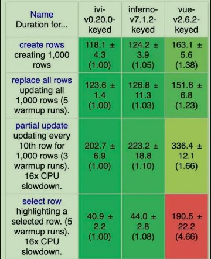
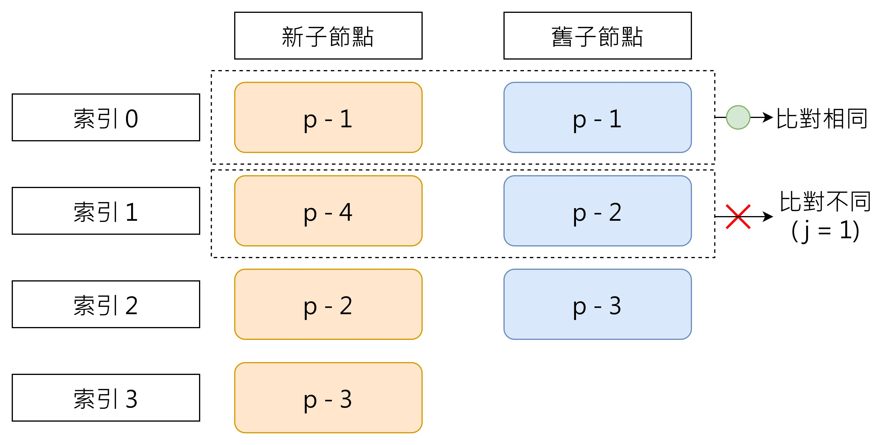
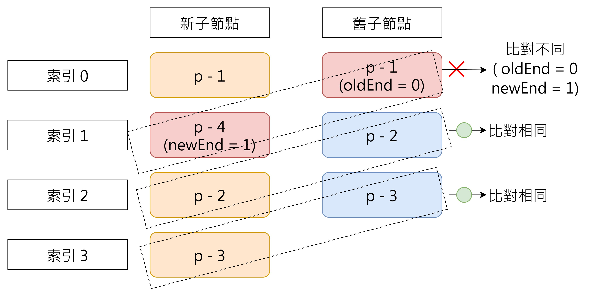
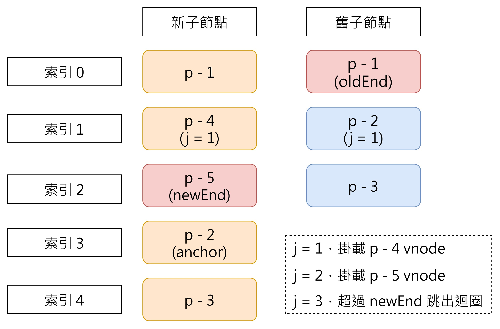
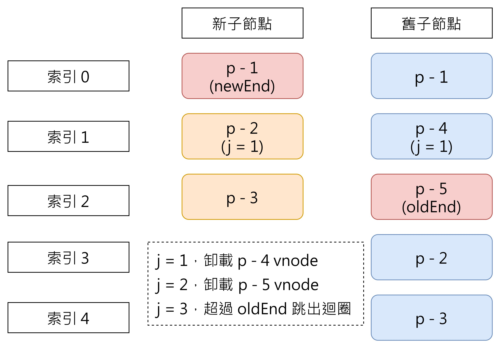
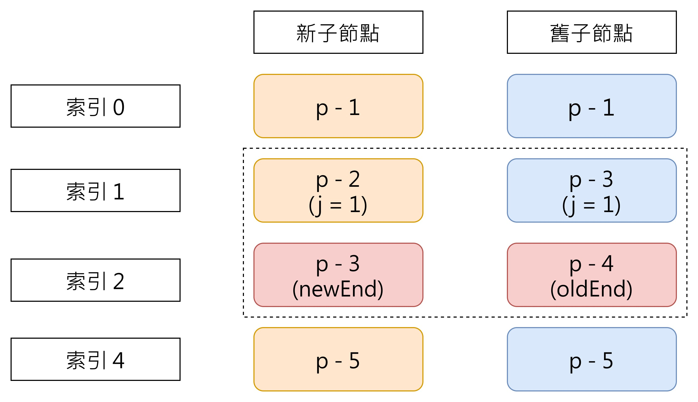
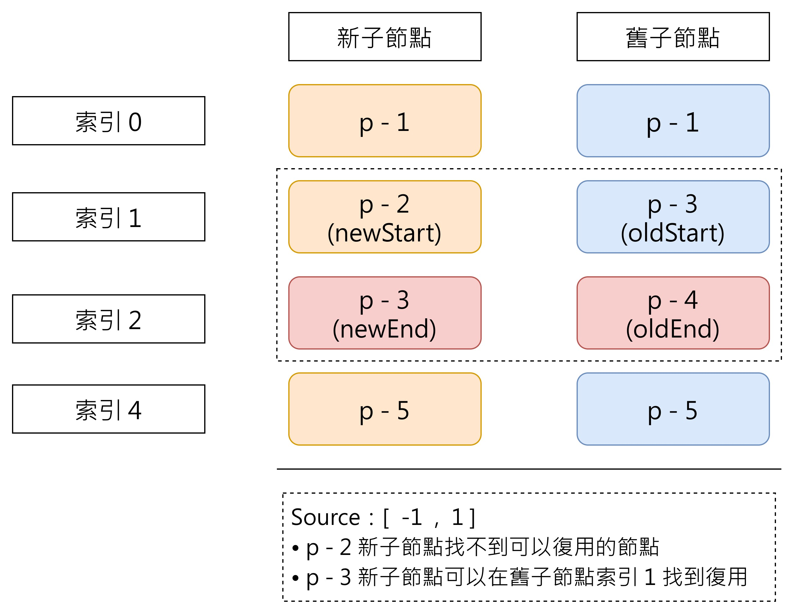
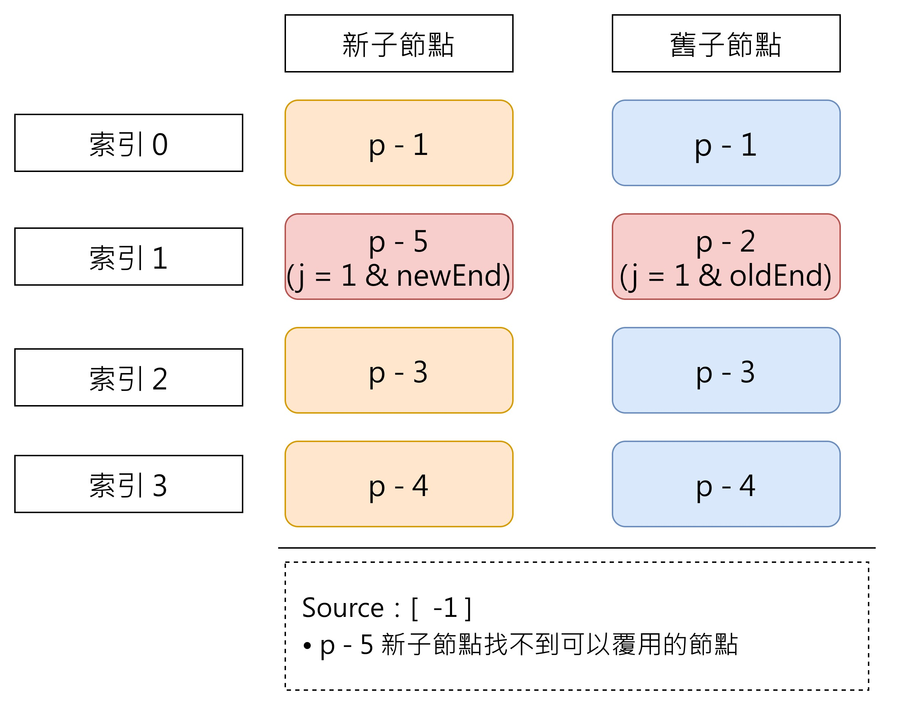
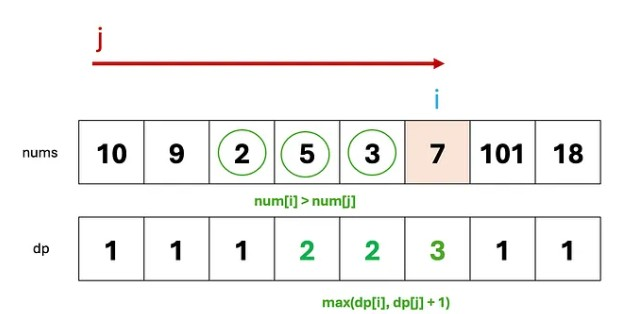
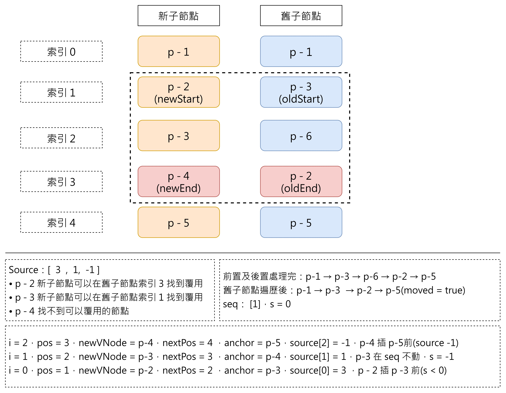

# Vue3 快速 Diff 算法

<div class="text-xl">
  <a href="https://github.com/vuejs/core/blob/main/packages/runtime-core/src/renderer.ts#L1784" target="_blank" class="slidev-icon-btn">
    <span class="pr-2">快速 diff 原始碼連結(1784 開始)</span>
    <carbon:logo-github />
  </a>
</div>

---

# 快速 Diff 起源

- 借鏡了 ivi 和 inferno 框架，其速度在 js-framework-benchmark 中，比 Vue 2 還快。

其核心概念是使用文字預處理的思路，將文本對齊之後，再進行 Diff 的比較。

```text
welcome to Guangdong, i hope you have a great travel.
welcome to Beijing, i hope you have a great travel.
```

 {.section-image}

<style scope>
.slidev-code-wrapper{
  width: 100%;
  overflow: clip;
}
</style>

---

# 快速 Diff 流程

<v-clicks every="1" depth="2">

1. 前置節點比對：從頭開始比對相同的節點，決定 j 索引位置。
2. 後置節點比對：從尾端開始比對相同的節點，決定 oldEnd 和 newEnd 索引位置。
3. 純新增處理：處理只有新增節點的情況
4. 純刪除處理：處理只有刪除節點的情況
5. 複雜場景處理：當存在節點移動時，使用 diff 演算法
    - 建立 key → index 映射表，判斷節點是否可以復用
    - 遍歷舊節點建立 source 映射關係 & 判斷節點是否需要移動
    - 掛載新節點 & 透過最長遞增子序列最小化移動操作

</v-clicks>

---

# 找出相同的前置節點

<div class="flex overflow-hidden gap-4">

```ts
  function patchKeyedChildren(n1, n2, container) {
    const newChildren = n2.children
    const oldChildren = n1.children
    // j 用於定義前置節點位置
    let j = 0
    let oldVNode = oldChildren[j]
    let newVNode = newChildren[j]

    // while 向右遍歷，直到 key 不相同
    while (oldVNode.key === newVNode.key) {
      // 調用 patch 函數更新
      patch(oldVNode, newVNode, container)
      j++
      oldVNode = oldChildren[j]
      newVNode = newChildren[j]
    }
    // ...
  }
```



</div>

---

# 找出相同的後置節點

<div class="flex overflow-hidden gap-4">

```ts
  function patchKeyedChildren(n1, n2, container) {
    const newChildren = n2.children
    const oldChildren = n1.children
    // 前置節點處理(略過)
    
    // 後置節點處理
    let oldEnd = oldChildren.length - 1 // 舊子節點最後的索引值
    let newEnd = newChildren.length - 1 // 新子節點最後的索引值

    oldVNode = oldChildren[oldEnd]
    newVNode = newChildren[newEnd]
    
    // while 向左遍歷，直到遇到 key 不相同
    while (oldVNode.key === newVNode.key) {
      // 調用 patch 函數更新
      patch(oldVNode, newVNode, container)
      oldEnd--
      newEnd--
      oldVNode = oldChildren[oldEnd]
      newVNode = newChildren[newEnd]
    }
    // ...
  }
```



</div>

---

# 處理純新增節點的情形

1. **j > oldEnd**：代表預處理過程已處理完全部的舊子節點
2. **newEnd ≥ j**：代表新子節點中，有未被處理的子節點需要掛載

<div class="flex overflow-hidden gap-4">

```ts
function patchKeyedChildren(n1, n2, container) {
  const newChildren = n2.children
  const oldChildren = n1.children
  // 省略前置節點及後置節點的處理
  // 純新增節點條件
  if (j > oldEnd && j <= newEnd) {
        // 錨點索引
        const anchorIndex = newEnd + 1
        // 錨點元素
        const anchor = anchorIndex < newChildren.length ? newChildren[anchorIndex].el : null
        // 使用 while 循環，調用 patch 逐個掛載節點
        while (j <= newEnd) {
          patch(null, newChildren[j++], container, anchor)
        }
  }
}
```



</div>

---

# 處理純刪除節點的情形

1. **j > newEnd**：代表預處理過程已處理完全部的新子節點
2. **oldEnd ≥ j**：代表舊子節點中，有需要被卸載處理的子節點

<div class="flex overflow-hidden gap-4">

```ts
  function patchKeyedChildren(n1, n2, container) {
    const newChildren = n2.children
    const oldChildren = n1.children
    // 省略前置節點及後置節點的處理
    // 純移除節點條件
		if (j > oldEnd && j <= newEnd) {
			// 舊子節點比較完，僅需處理掛載節點
		}else if(j > newEnd && j <= oldEnd){
			// 新子節點比較完，僅需處理需卸載節點
			while( j <= oldEnd){
				unmount(oldChildren[j++])
			}
		}
  }
```



</div>

---

# 處理複雜場景

在前置與後置比對階段，只會遇到「純新增」與「純刪除」的情況，不需要進行移動操作。但在更複雜的情形下，新舊子節點的順序可能發生變動，且無法一一對應。這時就需要透過**中段節點 diff**，綜合處理節點的復用、刪除、新增與移動。


<div class="flex overflow-hidden gap-4">

```ts
function patchKeyedChildren(n1, n2, container) {
  // 省略前置節點及後置節點的處理
  if (j > oldEnd && j <= newEnd) {
    // 舊子節點比較完，僅需處理掛載節點
  }else if(j > newEnd && j <= oldEnd){
    // 新子節點比較完，僅需處理需卸載節點
  }else{
    // 中段 diff 處理複雜場景
}
```



</div>

---

# 中段 diff 處理流程 1 - 確認可以複用的舊子節點


- 雙層迴圈遍歷舊子節點中段區域，找出可以複用的節點，並調用 patch 函數更新內容。

**時間複雜度 O(n x m) ⇒ O(n^ 2)**

<div class="flex overflow-hidden gap-4">

```ts
  function patchKeyedChildren(n1, n2, container) {
    // 省略前置節點及後置節點的處理
		if (j > oldEnd && j <= newEnd) {
			// 舊子節點比較完，僅需處理掛載節點
		}else if(j > newEnd && j <= oldEnd){
			// 新子節點比較完，僅需處理需卸載節點
		}else{
			// 中段 diff 比較處理區域		
		  // oldStart 和 newStart 分別為起始索引，即 j
		  const oldStart = j
		  const newStart = j
		
		  // 雙層迴圈找出可覆用的節點
		  for (let i = oldStart; i <= oldEnd; i++) {
		    const oldVNode = oldChildren[i]
		    for (let k = newStart; k <= newEnd; k++) {
		      const newVNode = newChildren[k]
		      if (oldVNode.key === newVNode.key) {
            // 更新覆用節點內容
		        patch(oldVNode, newVNode, container)
		      }
		    }
		  }
  }
```


</div>

<v-click>

> 隨著新舊子節點數量增加，效能會急劇下降。因此需要優化這個過程

</v-click>

---

# 中段 diff 處理流程 1 - 確認可複用的舊子節點(優化版)


- 使用**keyIndex 索引表**：將新子節點的 key 映射到索引位置，透過單層迴圈遍歷舊子節點，並使用索引表進行 O(1) 時間查找對應的新節點。

**時間複雜度降低成：O(n + m)  ⇒ O(n)**

<div class="flex overflow-hidden gap-4">

```ts
  function patchKeyedChildren(n1, n2, container) {
    // 省略前置節點及後置節點的處理
		if (j > oldEnd && j <= newEnd) {
			// 舊子節點比較完，僅需處理掛載節點
		}else if(j > newEnd && j <= oldEnd){
			// 新子節點比較完，僅需處理需卸載節點
		}else{
			// 中段 diff 比較處理區域		
		  // oldStart 和 newStart 分別為起始索引，即 j
		  const oldStart = j
		  const newStart = j
		
      const keyIndex = new Map()

      // 遍歷新子節點，建立索引表
      for (let i = newStart; i <= newEnd; i++) {
        keyIndex.set(newChildren[i].key, i)
      }

      // 遍歷舊子節點，通過索引表查找
      for (let i = oldStart; i <= oldEnd; i++) {
        const oldVNode = oldChildren[i]
        
        // O(1) 時間查找對應的新節點索引
        const k = keyIndex.get(oldVNode.key)

        if (typeof k !== undefined) {
          // 找到可覆用的節點
          const newVNode = newChildren[k]
          patch(oldVNode, newVNode, container)
        }
      }
  }
}
```


</div>

> keyIndex Map：鍵是「新子節點的 key」，值是「新節點在新子節點陣列中的索引」

---

# 中段 diff 處理流程 2 - 遍歷舊節點建立 source 映射關係

前面已經能判斷哪些舊節點可以複用，接下來需要建立一個 source 陣列來記錄這些可複用節點的對應關係。

透過 source 陣列，我們可以追蹤哪些舊節點被複用、哪些需要刪除，以及哪些新節點需要新增。

<div class="flex overflow-hidden gap-4">

```ts
function patchKeyedChildren(n1, n2, container) {
  // 省略前置節點及後置節點的處理
  if (j > oldEnd && j <= newEnd) {
    // 舊子節點比較完，僅需處理掛載節點
  }else if(j > newEnd && j <= oldEnd){
    // 新子節點比較完，僅需處理需卸載節點
  }else{
      // 中段 diff 比較處理區域

      // == 新增 source 陣列建立映射關係(預設填滿 -1) ==
      const count = newEnd - j + 1
      const source = new Array(count)
      source.fill(-1)
        // == 新增 source 陣列建立映射關係 ==

      const oldStart = j
      const newStart = j
    
      const keyIndex = new Map()

      for (let i = newStart; i <= newEnd; i++) {
        keyIndex.set(newChildren[i].key, i)
      }

      for (let i = oldStart; i <= oldEnd; i++) {
        const oldVNode = oldChildren[i]
        const k = keyIndex.get(oldVNode.key)

        if (typeof k !== undefined) {
          // 找到可覆用的節點
          const newVNode = newChildren[k]
          patch(oldVNode, newVNode, container)
          // 更新 source 陣列映射關係
          source[k - newStart] = i
        }
      }
  }
}
```



</div>

> source 陣列：記錄新子節點對應的舊子節點索引位置（若無對應則為 -1）

---

# source 陣列應用 - 舊子節點卸載

- **找不到對應新節點**：遍歷舊子節點時，若某個舊節點在新節點中找不到匹配的 key，表示該節點需要被卸載。
- **已復用數量達到上限**：當已複用的節點數達到新子節點總數時，表示所有需要的節點都已找到，剩餘的舊節點都是多餘的，應直接卸載。

<div class="flex overflow-hidden gap-4">

```ts
function patchKeyedChildren(n1, n2, container) {
  // 省略前置節點及後置節點的處理
  if (j > oldEnd && j <= newEnd) {
    // 舊子節點比較完,僅需處理掛載節點
  } else if (j > newEnd && j <= oldEnd) {
    // 新子節點比較完,僅需處理需卸載節點
  } else {
    const count = newEnd - newStart + 1
    const source = new Array(count)
    source.fill(-1)
    
    const oldStart = j
    const newStart = j

    // ★ patched 用於記錄已複用的節點數量
    let patched = 0
    
    const keyIndex = new Map()
    for (let i = newStart; i <= newEnd; i++) {
      keyIndex.set(newChildren[i].key, i)
    }
    
    for (let i = oldStart; i <= oldEnd; i++) {
      const oldVNode = oldChildren[i]
      
      // ★ 檢查：是否還有新節點需要匹配
      if (patched < count) {
        const k = keyIndex.get(oldVNode.key)
        
        if (k !== undefined) {
          const newVNode = newChildren[k]
          patch(oldVNode, newVNode, container)
          patched++
          source[k - newStart] = i
        } else {
          // ★ 舊節點在新節點中找不到對應，需卸載
          unMount(oldVNode)
        }
      } else {
        // ★ 所有新節點都已處理完畢，剩餘的舊節點為多餘節點，直接卸載
        unMount(oldVNode)
      }
    }
  }
}
```


</div>

> - Source 陣列長度是中段區域新子節點的數量(newEnd - newStart + 1)
> - Source 陣列紀錄的索引是中段區域的新子節點在舊子節點陣列中的位置(k - newStart)

---

#  中段 diff 處理流程 2 - 判斷節點是否需要移動

在處理節點移動前，需要先判斷是否存在需要移動的節點。若存在，則使用「最長遞增子序列(LIS)」演算法來優化移動操作，減少 DOM 操作次數。

<div class="flex overflow-hidden gap-4">

```ts
function patchKeyedChildren(n1, n2, container) {
  // 省略前置節點及後置節點的處理
  if (j > oldEnd && j <= newEnd) {
    // 舊子節點比較完,僅需處理掛載節點
  } else if (j > newEnd && j <= oldEnd) {
    // 新子節點比較完,僅需處理需卸載節點
  } else {
    const count = newEnd - newStart + 1
    const source = new Array(count)
    source.fill(-1)
    
    const oldStart = j
    const newStart = j
    let moved = false
    let pos = 0
    let patched = 0
    
    const keyIndex = new Map()
    for (let i = newStart; i <= newEnd; i++) {
      keyIndex.set(newChildren[i].key, i)
    }
    
    for (let i = oldStart; i <= oldEnd; i++) {
      const oldVNode = oldChildren[i]
      
      if (patched < count) {
        const k = keyIndex.get(oldVNode.key)
        
        if (typeof k !== undefined) {
          const newVNode = newChildren[k]
          patch(oldVNode, newVNode, container)
          patched++
          source[k - newStart] = i
          
          // ★ 判斷是否需要移動(跟簡單 diff 方法一樣，透過是否保持遞增性來判斷)
          if (k < pos) {
            moved = true
          } else {
            pos = k
          }
        } else {
          unMount(oldVNode)
        }
      } else {
        unMount(oldVNode)
      }
    }
  }
}
```


</div>

---

# 中段 diff 處理流程到目前為止存在的問題

前面已經完成舊子節點的處理：複用可複用的節點、卸載多餘的節點，並判斷是否需要移動

但如果有全新的節點需要新增呢？

**考慮以下情境：**


<div class="flex overflow-hidden gap-4">

{.custom-img}

<div class="flex flex-col gap-2">

  <v-click>  

  **當前情況不符合以下兩個原則**
  - j 沒有大於 newEnd，不屬於純刪除
  - j 沒有大於 oldEnd，不屬於純新增

  </v-click>

  <v-click>  

  **當我們處理完前面的步驟後：**
  - p-1 節點在前置比對中複用，位置不變
  - p-3 & p-4 節點在後置比對中複用，位置不變
  - p-2 節點在中段處理中卸載，索引遞增，不需移動

  </v-click>

  <v-click>  

  **★ 但我們遺漏了 p-5 節點！**

  </v-click>
</div>

</div>

<style>

.slidev-layout p:has(> img){
  margin: auto;
}

p:has(.custom-img){
  height: 100%;
}

</style>

---

# 中段 diff 處理流程 3 - 掛載新節點

當遍歷新子節點的中段 diff 區域時，若 source 陣列中對應位置為 **-1**，代表該節點是全新的，需要執行掛載操作

<div class="flex overflow-hidden gap-4">

```ts
function patchKeyedChildren(n1, n2, container) {
  // 省略前置節點及後置節點的處理
  if (j > oldEnd && j <= newEnd) {
    // 舊子節點比較完,僅需處理掛載節點
  } else if (j > newEnd && j <= oldEnd) {
    // 新子節點比較完,僅需處理需卸載節點
  } else {
    const count = newEnd - newStart + 1
    const source = new Array(count)
    source.fill(-1)
    
    const oldStart = j
    const newStart = j
    let moved = false
    let pos = 0
    let patched = 0
    
    const keyIndex = new Map()
    for (let i = newStart; i <= newEnd; i++) {
      keyIndex.set(newChildren[i].key, i)
    }
    
    // 遍歷舊節點建立 source 映射關係 & 判斷節點是否需要移動
    for (let i = oldStart; i <= oldEnd; i++) {...}

    // 從後向前遍歷（只需要一次循環）
		for (let i = count - 1; i >= 0; i--) {
		  const pos = newStart + i
		  const newVNode = newChildren[pos]
		  const nextPos = pos + 1
		  const anchor = nextPos < newChildren.length 
		    ? newChildren[nextPos].el 
		    : null
		  
		  if (source[i] === -1) {
		    // 新增節點
		    patch(null, newVNode, container, anchor)
		  }
    }
  }
}
```


</div>

> anchor 是 newend + 1，將 p-5 插入新子節點 p-3 的前面

---

# 如何減少 DOM 移動？認識 LIS 最長遞增子序列

LIS 最長遞增子序列：在陣列中找出最長的遞增子序列，元素需保持原順序但不必連續。

這邊介紹比較直觀的動態規劃方法。
- 時間複雜度：O(n^2)

<div class="flex overflow-hidden gap-4">




</div>

> 最終輸出：[2, 3, 7, 18]，長度為 4（可能有多組解）

[資料來源](https://medium.com/%E6%8A%80%E8%A1%93%E7%AD%86%E8%A8%98/leetcode-%E8%A7%A3%E9%A1%8C%E7%B4%80%E9%8C%84-300-longest-increasing-subsequence-f160358db4d1)


---

# 中段 diff 處理流程 3 - 利用 LIS 最小化移動操作

目的：在遍歷新子節點時，保持 LIS 中的節點位置不動，僅移動其他節點到正確位置。

<div class="flex overflow-hidden gap-4">

```ts
function patchKeyedChildren(n1, n2, container) {
  // 省略前置節點及後置節點的處理
  if (j > oldEnd && j <= newEnd) {
    // 舊子節點比較完,僅需處理掛載節點
  } else if (j > newEnd && j <= oldEnd) {
    // 新子節點比較完,僅需處理需卸載節點
  } else {
    const count = newEnd - newStart + 1
    const source = new Array(count)
    source.fill(-1)
    
    const oldStart = j
    const newStart = j
    let moved = false
    let pos = 0
    let patched = 0
    
    const keyIndex = new Map()
    for (let i = newStart; i <= newEnd; i++) {
      keyIndex.set(newChildren[i].key, i)
    }
    for (let i = oldStart; i <= oldEnd; i++) {...}

    // ★ 透過 source 陣列取得 LIS 序列
    const seq = moved ? getSequence(source) : []
		let s = seq.length - 1
    // 從後向前遍歷（只需要一次循環）
		for (let i = count - 1; i >= 0; i--) {
		  const pos = newStart + i
		  const newVNode = newChildren[pos]
		  const nextPos = pos + 1
		  const anchor = nextPos < newChildren.length 
		    ? newChildren[nextPos].el 
		    : null
		  
		  if (source[i] === -1) {
		    patch(null, newVNode, container, anchor)
		  }else if(moved){
        // 判斷當前新子節點索引是否在 LIS 中
        if (s < 0 || i !== seq[s]) {
          // 是移動位置而不是更新(更新在前面遍歷舊節點時已處理)
          insert(newVNode.el, container, anchor)
        }else{
          // 存在子序列中，指標向前移動
          s--
        }
      }
    }
  }
}
```



</div>

---
layout: cover
---

# 組件的實作原理

---

# 渲染組件流程

渲染器可以根據不同的 **vnode.type** 採用不同的處理方法完成掛載和更新。

> 組件是對頁面內容的封裝單元，用於描述頁面的特定部分。每個組件都包含一個渲染函數(render)，該函數負責返回對應的虛擬 DOM 結構

<div class="flex overflow-hidden gap-4">

```ts
function patch(n1, n2, container, anchor = null) {
    if (n1 && n1.type !== n2.type) {
      unmount(n1);
      n1 = null;
    }
    const { type } = n2;
    if (typeof type === "string") {
      // 作為普通元素處理
    }else if(type === Text){
		  // 作為文本節點處理(Text 是 Symbol)
    }else if(type === Fragment){
			// 作為片段處理(Fragment 是 Symbol)
    } else if (typeof type === "object") {
      // 組件
      if (!n1) {
        // 掛載組件
        mountComponent(n2, container, anchor);
      } else {
        // 更新組件
        patchComponent(n1, n2, anchor);
      }
    }
  }
}
```

```ts
// 組件描述
const MyComponent = {
  render() {
    return {
      type: "div",
      children: `hello world !!!`
    };
  }
};

// 組件的 vnode 表示
const componentVnode = {
  type: MyComponent,
};
```

</div>

---

# 回想渲染器架構

- mountComponent: 負責執行組件的 render 函數
- mountElement: 負責創建真實 DOM

<div class="flex overflow-hidden gap-4">

```ts
// 正規化字串、陣列及物件屬性表示方式
function normalizeClass(value) {...}

// prop vs attribute 判斷邏輯
function shouldSetAsProps(el, key) {...}

function createRenderer(options) {
  const { createElement, setElementText, insertElement, patchProps, unmount } = options;

  // 掛載普通元素邏輯區域
  function mountElement(vnode, container, anchor = null) {...}

	// 掛載組件
  function mountComponent(vnode, container, anchor = null) {
    const componentOptions = vnode.type;
     // 執行組件的 render 函數,得到要渲染的虛擬 DOM
    const { render } = componentOptions;
    const subTree = render();
    // 遞歸調用 patch,這次會進入 mountElement 分支
    patch(null, subTree, container, anchor);
  }

  function patch(n1, n2, container, anchor = null) {
      if (n1 && n1.type !== n2.type) {
        unmount(n1);
        n1 = null;
      }
      const { type } = n2;
      if (typeof type === "string") {
        // 作為普通元素處理
      }else if(type === Text){
        // 作為文本節點處理(Text 是 Symbol)
      }else if(type === Fragment){
        // 作為片段處理(Fragment 是 Symbol)
      } else if (typeof type === "object") {
        // 組件
        if (!n1) {
          // 掛載組件
          mountComponent(n2, container, anchor);
        } else {
          // 更新組件
          patchComponent(n1, n2, anchor);
        }
      }
    }
  }

  // 如果節點不存在，則調用 patch 函數進行掛載
  function render(vnode, container) {...}

  return { render };
}

// 可選配置(控制反轉讓使用者決定掛載、卸載、更新等操作的邏輯)
const options = {...};

const renderer = createRenderer(options);

// 組件描述
const MyComponent = {
  render() {
    return {
      type: "div",
      children: `hello world !!!`
    };
  }
};

// 組件的 vnode 表示
const componentVnode = {
  type: MyComponent,
};

// 渲染組件
renderer.render(componentVnode, document.querySelector("#app"));
```
<div class="w1/2 overflow-auto flex flex-col">

### 流程說明

<hr class="mt-2 mb-2" />

1. **啟動渲染(渲染器入口)**
    - renderer.render(componentVnode, container)

2. **進入 patch 邏輯**
    - n1 為 null 表示首次掛載
    - patch(null, componentVnode, container)

3. **組件類型判斷**
    - typeof vnode.type === "object" 為 true
    - 調用 mountComponent

4. **執行組件渲染**
    - render() 函數執行，返回 subTree 虛擬 DOM

5. **遞歸 patch 子樹，處理組件的渲染結果**
    - patch(null, subTree, container) 

6. **元素類型判斷**
    - typeof vnode.type === "string" 為 true
    - 調用 mountElement

7. **創建真實節點**
    - 根據 vnode 生成真實 DOM 並掛載

</div>

</div>

<style scope>

strong{
  display: block;
}
</style>

---

# 以 Options API 為例，探討組件自身狀態管理及更新

- 透過 **data** 函數定義組件內部狀態 **foo**
- 在 **render 函數**中使用 **this.foo** 訪問響應式狀態
- 使用 **effect** 建立響應式依賴收集，當狀態變化時自動觸發重新渲染

<div class="flex overflow-hidden gap-4">

```ts
const MyComponent = {
	data(){
		return {
			foo: 'Hello foo Component'
		}
	},
  render() {
    return {
      type: 'div',
      children: `查看定義的 foo 變數：${this.foo}`
    };
  }
};
```

```ts
function mountComponent(vnode, container, anchor = null) {
  const componentOptions = vnode.type;
    // 取出組件的 data 與 render 函數
  const { render, data } = componentOptions;
  // 取得 data 返回原始物件，並使用 reactive 包裝為響應式
  const state = reactive(data())

  effect(() => {
      // 綁定 this 為 state，使 render 內部可通過 this 訪問狀態
      const subTree = render.call(state, state);
      // 執行 patch 進行 DOM 更新
      patch(null, subTree, container, anchor);
  });
}
```
</div>

> 每次響應式狀態變化時，effect 會**同步執行**。如果在同一時刻多次修改狀態，就會觸發多次重新渲染，造成不必要的性能開銷

<style scope>

.slidev-code-wrapper{
  width: 100%
}

.flex > .slidev-code-wrapper{
  width: 50%
}

</style>

---

# 使用 Scheduler 延緩更新

- 引入任務隊列與微任務機制，將多次狀態變更的更新操作合併到下一個微任務中執行，避免重複渲染

<div class="flex overflow-hidden gap-4">

```ts
// 任務隊列，搭配 Set 去重
const queue = new Set();
// 是否正在刷新任務隊列
let isFlushing = false;

function queueJob(job) {
  queue.add(job);
  
  if (!isFlushing) {
    isFlushing = true;
    Promise.resolve().then(() => {
      try {
        queue.forEach(job => job());
      } finally {
        isFlushing = false;
        queue.clear();
      }
    });
  }
}
```

```ts
function mountComponent(vnode, container, anchor = null) {
  const componentOptions = vnode.type;
  const { render, data } = componentOptions;
  const state = reactive(data())

  // ★ 加入 scheduler options 延遲任務執行
  effect(() => {
      const subTree = render.call(state, state);
      patch(null, subTree, container, anchor);
  }, { scheduler: queueJob});
}
```

</div>

> 目前 `patch` 的第一個參數固定為 `null`，導致每次更新都重新掛載。接下來我們來實現組件**實例機制**，保存上一次渲染的 subTree，實現節點複用與 diff 更新。

---

# 為什麼需要組件實例？

組件實例是一個**持久化的上下文對象**，為組件提供「記憶」能力：
- **保存渲染歷史**：存儲上一次的 subTree，使 patch 能夠進行 diff 比對，實現局部更新
- **管理組件狀態**：統一存放響應式狀態（state）、外部屬性（props）等數據
- **追蹤更新狀態**：標記組件的掛載狀態（isMounted）、更新標記等信息
- **封裝生命週期**：為 mounted、updated、unmounted 等鉤子提供執行環境

<style scope>
ul li{
  line-height: 2.2;
}

</style>

---

# 為組件建立持久化上下文對象

<div class="flex overflow-hidden gap-4">


<div class="w1/2 flex flex-col">

- **管理組件狀態、追蹤更新狀態、保存渲染歷史**

```ts
function mountComponent(vnode, container, anchor = null) {
  const componentOptions = vnode.type;
  const { render, data } = componentOptions;
  const state = reactive(data())
    // ★ 創建組件實例對象
    const instance = {
    // 響應式狀態
	  state,
    // 是否為初次掛載掛載
	  isMounted: false,
    // 組件上次渲染的虛擬 DOM 樹
	  subTree: null 
  }
  // ★ 將組件實例綁定到 vnode 上，方便後續更新使用
  vnode.component = instance

  effect(() => {
      const subTree = render.call(state, state);
      // ★ 判斷需要掛載還是更新
      if(!instance.isMounted){
        // 首次掛載：沒有舊的 VNode，直接創建 DOM
        patch(null, subTree, container, anchor);
        // 調整標記為已掛載
        instance.isMounted = true
      }else{
        // 更新階段:有舊的 VNode，進行 diff 對比
        patch(instance.subTree, subTree, container, anchor);
      }
      // 保存本次的 VNode，供下次比對使用
      instance.subTree = subTree;
  }, { scheduler: queueJob});
}
```
</div>

<div class="w1/2 flex flex-col">

- **封裝生命週期**

```ts
function mountComponent(vnode, container, anchor = null) {
  const componentOptions = vnode.type;
  // ★ 傳入不同生命週期定義函數
  const { render, data, beforeCreate, created, beforeMount, mounted, beforeUpdate, updated } = componentOptions;
    // ★ beforeCreate 生命週期 hook(組件實例初始化之前，無法訪問 state)
  beforeCreate && beforeCreate.call(null);
  const state = reactive(data())
  const instance = {
    state,
    isMounted: false,
    subTree: null 
  }
  vnode.component = instance
  // ★ created 生命週期 hook(響應式數據創建完成)
  created && created.call(state)

  effect(() => {
      const subTree = render.call(state, state);

      if(!instance.isMounted){
        // ★ beforeMount 生命週期 hook(組件掛載到 DOM 之前)
		    beforeMount && beforeMount.call(state)
        patch(null, subTree, container, anchor);
        instance.isMounted = true
        // ★ mounted 生命週期 hook(組件掛載完成之後，需考量 queuePostFlushCb 避免同步執行)
		    mounted && mounted.call(state)
      }else{
        // ★ beforeUpdate 生命週期 hook(組件更新之前)
		    beforeUpdate && beforeUpdate.call(state)
        patch(instance.subTree, subTree, container, anchor);
	      // ★ updated 生命週期 hook(組件更新完成後，需考量 queuePostFlushCb 避免同步執行)
		    updated && updated.call(state)
      }

      instance.subTree = subTree;
  }, { scheduler: queueJob});
}
```
</div>

</div>

<style scope>

.slidev-code-wrapper{
  width: 100%;
  height: 100%;
  overflow: auto;
}
</style>

---

# 組件 Props 和透傳屬性處理

組件內定義的 **props** 會使用 **shallowReactive** 進行淺層響應式處理。若傳遞的屬性未在 **props** 中定義，則會被歸類為**透傳屬性 attrs**


<div class="flex overflow-hidden gap-4">


<div class="w1/2 flex flex-col custom">

- **Template**

```ts
<MyComponent title="A" :other="val">
```

- **組件 & vnode 定義**

```ts
const MyComponent = {
	props: {
		title: String
	},
  render() {
    return {
      type: "div",
      children: `title is ${this.title}`
    };
  }
};

const componentVnode = {
  type: MyComponent,
  props: {
	  title: "I am title",
	  other: this.val
  }
};
```

</div>

<div class="w1/2 flex flex-col">

- **mountComponent 組件掛載方法**

```ts
function mountComponent(vnode, container, anchor = null) {
  const componentOptions = vnode.type;

  // ★ 取出組件 props 定義
  const { render, data, props: propsOption } = componentOptions;
  // ★ 根據定義解析傳入的屬性，目前僅處理 props 的部分
  const [ props, attrs] = resolveProps(propsOption, vnode.props)

  const state = reactive(data())
  const instance = {
    state,
    isMounted: false,
    // ★ shallowReactive 保持淺層響應式
    props: shallowReactive(props),
    subTree: null 
  }
  vnode.component = instance

  // 省略 effect 邏輯
}

// ★ 定義組件屬性解析優先順序
function resolveProps(options, propsData){
	const props = {}
	const attrs = {}
	
	for(const key in propsData){
    if(key in options){  
      // ★ 在組件定義的 props 中 → 歸類為 props
      props[key] = propsData[key]
    }else{
      // 不在組件定義的 props 中 → 歸類為 attrs
      attrs[key] = propsData[key]
    }
	}
	
	return [props, attrs]
}
```
</div>

</div>

<style scope>
.slidev-code-wrapper{
  width: 100%;
  height: 100%;
  overflow: auto;
}

.custom .slidev-code-wrapper{
  height: auto;

  &:nth-of-type(2){
    flex: 1;
  }
}
</style>

---

# 父組件 Props 改動更新子組件

當父組件的 props 發生變化時，會觸發 `patchComponent` 進行組件更新。由於子組件的 props 採用 `shallowReactive` 響應式處理，直接修改 props 對象的屬性會觸發響應式系統的依賴更新，進而驅動子組件的渲染 effect 重新執行，完成子組件的重新渲染。

<div class="flex overflow-hidden gap-4">


<div class="w1/2 flex flex-col custom">

- **Template**

```vue
<template>
  <MyComponent :title="title">
</template>
```

- **組件 & vnode 定義**

```ts
const MyComponent = {
	props: {
		title: String
	},
  render() {
    return {
      type: "div",
      children: `title is ${this.title}`
    };
  }
};

const componentVnode = {
  type: MyComponent,
  props: {
	  title: "I am title",
  }
};
```

</div>

<div class="w1/2 flex flex-col">

- **patchComponent 組件更新方法**

```ts
function patchComponent(n1, n2, anchor) {
  // 獲取組件實例並且復用
  const instance = (n2.component = n1.component)
  // 取得子組件實例中的響應式 props（shallowReactive）
  const { props } = instance
  
  // 檢查 props 是否改變
  if (hasPropsChanged(n1.props, n2.props)) {
    // 解析新的 props
    const { type } = n2
    // resolveProps 前面提到會回傳 props 與 attrs，這邊暫時僅先處理 props
    const [nextProps] = resolveProps(type.props, n2.props)
    
    // 更新存在的 props，改動屬性 -> 觸發 shallowReactive 變更偵測
    for (const key in nextProps) {
      props[key] = nextProps[key]
    }
    
    // 刪除不存在的舊 props -> 觸發 shallowReactive 變更偵測
    for (const k in props) {
      if (!(k in nextProps)) {
        delete props[k]
      }
    }
  }
}

// 檢查 props 是否改變
function hasPropsChanged(prevProps, nextProps) {  
  const nextKeys = Object.keys(nextProps)
  // 如果新舊組件 vnode 的 props 長度不同，則表示有改變
  if (nextKeys.length !== Object.keys(prevProps).length) {
    return true
  }
  
  // 僅針對 props 中的屬性進行淺層比對
  for (let i = 0; i < nextKeys.length; i++) {
	  const key = nextKeys[i]
    if (nextProps[key] !== prevProps[key]) {
      return true
    }
  }
  
  return false
}
```
</div>

</div>

<style scope>
.slidev-code-wrapper{
  width: 100%;
  height: 100%;
  overflow: auto;
}

.custom .slidev-code-wrapper{
  height: auto;

  &:nth-of-type(2){
    flex: 1;
  }
}
</style>

---

# 使用 instance 綁定 this 的問題

將組件的生命週期函數和 render 函數的 this 直接綁定到 instance，目前會引發兩個問題：
1. **訪問 props 和 state 過於冗長**：子組件需要透過 this.props 和 this.state 明確指定來源來訪問 props 和 state
2. **無法攔截 props 的修改**：直接修改 props 不會被攔截，違反了「props 應該是只讀的」原則

<div class="flex overflow-hidden gap-4">

<div class="w1/2 flex flex-col">

- **使用 instance 綁定**

```ts
function mountComponent(vnode, container, anchor = null) {
  const componentOptions = vnode.type;
  const { render, data, props: propsOption, created } = componentOptions;
  const [ props, attrs] = resolveProps(propsOption, vnode.props)

  const state = reactive(data())
  const instance = {
    state,
    isMounted: false,
    props: shallowReactive(props),
    subTree: null 
  }
  vnode.component = instance

 // ★ 綁定組件生命週期 this 為 instance
  created && created.call(instance)
  // 省略 effect 邏輯
}
```
</div>

<div class="w1/2 flex flex-col custom">

- **組件內的訪問方式**

```ts
const MyComponent = {
  props: {
    title: String
  },
  data() {
    return {
      count: 0
    };
  },
  created() {
    // 必須明確指定從哪裡取值
    console.log(this.props.title);
    console.log(this.state.count);
    // 修改 props 不會被攔截
    this.props.title = "new";
  },
  render() {
    // 訪問變得冗長
    return {
      type: "div",
      children: `${this.props.title}: ${this.state.count}`
    };
  }
};
```
</div>

</div>

<style scope>
.slidev-code-wrapper{
  width: 100%;
  height: 100%;
  overflow: auto;
}

.custom .slidev-code-wrapper{
  height: auto;
  flex: 1;
}
</style>

---

# 使用 Proxy 針對 instance 進行攔截處理

<div class="flex overflow-hidden gap-4">

<div class="w1/2 flex flex-col">

- **使用 renderContext Proxy 物件綁定**

```ts
function mountComponent(vnode, container, anchor = null) {
  // 略過部分代碼

  const instance = {
    state,
    isMounted: false,
    props: shallowReactive(props),
    subTree: null 
  }
  
  vnode.component = instance

  // ★ 使用 Proxy 攔截 instance 的屬性訪問
  const renderContext = new Proxy(instance, {
    get(t, k, r) {
      const { state, props } = t
      
      // ★ 優先從 state 查找，其次從 props 查找
      if (state && k in state) { 
        return state[k]
      } else if (k in props) { 
        return props[k]
      }else{
        console.error('不存在')
      }
    },
    set(t, k, v) {
      const { state, props } = t
      if (state && k in state) {
        state[k] = v
      } else if (k in props) {
        // ★ 攔截 props 修改，發出警告
        console.warn(`Attempting to mutate prop "${k}". Props are readonly.`)
      }else{
        console.error('不存在')
      }
      return true
    }
  })

 // ★ 綁定組件生命週期 this 為 renderContext
  created && created.call(renderContext)

  // 省略 effect 邏輯
}
```
</div>

<div class="w1/2 flex flex-col custom">

- **組件內的訪問方式**

```ts
const MyComponent = {
  props: {
    title: String
  },
  data() {
    return {
      count: 0
    };
  },
  created() {
    // 直接訪問，自動查找
    console.log(this.title);
    console.log(this.count);
    // 修改 props 應該被攔截並警告
    this.title = "new222";
  },
  render() {
    // 訪問更直觀
    return {
      type: "div",
      children: `${this.title}: ${this.count}`
    };
  }
};
```

</div>

</div>

<style scope>
.slidev-code-wrapper{
  width: 100%;
  height: 100%;
  overflow: auto;
}

.custom .slidev-code-wrapper{
  height: auto;
  flex: 1;
}
</style>

---

# Vue Composition API setup 函數的兩種返回方式

Vue3 Composition API 引入了 **setup 函數**，作為組件邏輯的入口點。

<div class="flex overflow-hidden gap-4">

<div class="w1/2 flex flex-col">

- **setup 返回渲染函數**

```ts
const Comp = {
  setup() {
    const count = ref(0)
    
    return () => {
      return { 
        type: 'div', 
        children: `count is: ${count.value}` 
      }
    }
  }
}
```
</div>

<div class="w1/2 flex flex-col custom">

- **setup 返回數據對象**

```ts
const Comp = {
  setup() {
    const count = ref(0)
    
    return {
      count
    }
  },
  render() {
    // ★ render 函數中可透過 this 訪問 setup 返回的屬性
    return { 
      type: 'div', 
      children: `count is: ${this.count}` 
    }
  }
}
```

</div>

</div>

> render 函數中透過 this 訪問 setup 返回的屬性，需要在組件實例的 renderContext Proxy 中進行額外處理

<style scope>
.slidev-code-wrapper{
  width: 100%;
  height: 100%;
  overflow: auto;
}

.custom .slidev-code-wrapper{
  height: auto;
  flex: 1;
}
</style>

---

# setup(props, setupContext) 參數說明

<div class="flex overflow-hidden gap-4">

- **props**：組件接收到的屬性對象
- **setupContext**：組件上下文相關資訊
  - **slots - Object**：插槽內容
  - **emit - Funtion**：觸發事件
  - **attrs - Object**：透傳屬性
  - **expose - Object**：暴露給父組件的屬性/方法


```ts
const MyComponent = {
  props: {
    title: String
  },
  setup(props, { attrs, slots, emit, expose }) {
    // 訪問 props
    console.log(props.title)
    // 訪問透傳屬性
    console.log(attrs.class)
    // 觸發事件
    const handleClick = () => {
      emit('update', newValue)
    }
    // 暴露給父組件的屬性/方法
    expose({
      focus: () => { /* ... */ }
    })
    
    return {
      handleClick
    }
  }
}
```

</div>

<style scope>
ul li{
  line-height: 2.4;
}
</style>

---

# 使用 Proxy 統一處理 setup 返回的數據

<div class="flex overflow-hidden gap-4">

<div class="children:leading-[2.2]! w-1/2">

setup 函數的返回值有兩種可能：
- **函數**：作為組件的 render 函數
- **對象**：作為組件的響應式狀態

<hr  class="mt-2  mb-2"/>

我們需要處理這兩種情況，並將對象形式的返回值整合到組件實例中，讓 **render 函數**可以通過 **this** 訪問 **setup 返回的屬性**

</div>

```ts
function mountComponent(vnode, container, anchor = null) {
  // 略過部分代碼
  const componentOptions = vnode.type
  let { render, data, setup, /* 省略其他選項 */ } = componentOptions
  const state = data ? reactive(data()) : null
  const [props, attrs] = resolveProps(propsOption, vnode.props)

  const instance = {
    state,
    isMounted: false,
    props: shallowReactive(props),
    subTree: null 
  }
  
  vnode.component = instance

  // ★ 構建 setupContext，包含 attrs 等屬性
  const setupContext = { attrs }
  // 調用 setup 函數
  // - 第一個參數：只讀版本的 props（防止在 setup 中修改 props）
  // - 第二個參數：setupContext（提供 attrs、emit 等上下文信息）
  const setupResult = setup(shallowReadonly(instance.props), setupContext)
  // setupState 用於存儲 setup 返回的數據對象
  let setupState = null
  // ★ 如果 setup 函數的返回值是函數,則將其作為組件的渲染函數
  if (typeof setupResult === 'function') {
    // 情況1：返回渲染函數
    if (render) console.error('setup 函數返回渲染函數，render 選項將被忽略')
    render = setupResult
  } else {
    // 情況2：返回狀態對象，保存到 setupState
    setupState = setupResult
  }


  const renderContext = new Proxy(instance, {
    // 優先級：state > props > setupState
    get(t, k, r) {
      const { state, props } = t
      
      if (state && k in state) { 
        return state[k]
      } else if (k in props) { 
        return props[k]
      } else if (setupState && k in setupState) {
        return setupState[k]
      } else{
        console.error('不存在')
      }
    },
    set(t, k, v) {
      const { state, props } = t
      if (state && k in state) {
        state[k] = v
      } else if (k in props) {
        // ★ 攔截 props 修改，發出警告
        console.warn(`Attempting to mutate prop "${k}". Props are readonly.`)
      } else if (setupState && k in setupState) {
        setupState[k] = v
      } else{
        console.error('不存在')
      }
      return true
    }
  })

 // ★ 綁定組件生命週期 this 為 renderContext
  created && created.call(renderContext)

  // 省略 effect 邏輯
}
```
</div>

---

# setupContext emit 觸發事件

<div class="flex overflow-hidden gap-4">


<div class="w1/2 flex flex-col custom">

- **Template**

```vue
<template>
  <MyComponent @change="handler" />
</template>
```

- **vnode 定義**

```ts
const CompVNode = {
  type: MyComponent,
  props: {
    onChange: handler
  }
}
```

</div>

<div class="w1/2 flex flex-col">

- **mountComponent  & resolveProps 處理**

```ts
function mountComponent(vnode, container, anchor) {
  const componentOptions = vnode.type
  let { render, data, setup, /* 省略其他選項 */ } = componentOptions
  const state = data ? reactive(data()) : null
  const [props, attrs] = resolveProps(propsOption, vnode.props)
  
  const instance = {
    state,
    props: shallowReactive(props),
    isMounted: false,
    subTree: null
  }
  
  vnode.component = instance
  
  // ★ 定義 emit 函數
  function emit(event, ...payload) {
    // 將事件名轉換為 props 中的屬性名
    // 例如: change -> onChange
    const eventName = `on${event[0].toUpperCase()}${event.slice(1)}`
    // 在 props 中查找對應的事件處理函數
    const handler = instance.props[eventName]
    if (handler) {
      // 調用事件處理函數並傳遞參數
      handler(...payload)
    } else {
      console.warn(`事件 "${event}" 不存在`)
    }
  }
  
  // ★ setupContext 的實現
  const setupContext = { attrs, emit } // 將 emit 函數添加到 setupContext
  // 省略代碼
}

// ★ 解析 Props & attr
function resolveProps(options, propsData){
	const props = {}
	const attrs = {}
	
	for(const key in propsData){
    // 判斷是否為 props：
    // 1.在 props 選項中顯式聲明的屬性
    // 2. 以 'on' 開頭的事件處理器（如 onClick、onUpdate），統一歸類為 props，無需在 props 選項中聲明。
    if(key in options || key.startsWith('on')){  
        props[key] = propsData[key]
    }else{
        attrs[key] = propsData[key]
    }
	}
	
	return [props, attrs]
}

```
</div>

</div>

<style scope>
.slidev-code-wrapper{
  width: 100%;
  height: 100%;
  overflow: auto;
}

.custom .slidev-code-wrapper{
  height: auto;

  &:nth-of-type(2){
    flex: 1;
  }
}
</style>

---

# slot 插槽內容傳遞原理

Vue 插槽在編譯後會轉換為**父組件提供的渲染函數**，子組件在渲染時調用這些函數來獲取 VNode。

這個模式類似 React 的 render props 概念：父組件傳遞渲染函數，子組件決定何時、在哪裡調用。

<div class="flex overflow-hidden gap-4">
<div class="w1/2 flex flex-col custom">

- **父組件模板**

```vue
<template>
  <MyComponent>
    <template #header>
      <h1>我是標題</h1>
    </template>
    
    <template #body>
      <section>我是內容</section>
    </template>
    
    <template #footer>
      <h1>我是註腳</h1>
    </template>
  </MyComponent>
</template>
```

- **父組件渲染函數**

```ts
function render() {
  return {
    type: MyComponent,
    // 這裡的 children 是「插槽物件」
    children: {
      header: () => [
        { type: 'h1', children: '我是標題' }
      ],
      body: () => [
        { type: 'section', children: '我是內容' }
      ],
      footer: () => [
        { type: 'h1', children: '我是註腳' }
      ]
    }
  }
}
```

</div>

<div class="w1/2 flex flex-col custom">

- **子組件模板(具名插槽)**

```vue
<template>
	<header><slot name="header" /></header>
	<body><slot name="body" /></body>
	<footer><slot name="footer" /></footer>
<template>
```

- **子組件渲染函數**

```ts
function render() {
  return [
    {
      type: 'header',
      children: [this.$slots.header()]
    },
    {
      type: 'body',
      children: [this.$slots.body()]
    },
    {
      type: 'footer',
      children: [this.$slots.footer()]
    }
  ]
}
```

</div>

</div>

<style scope>
.slidev-code-wrapper{
  width: 100%;
  height: 100%;
  overflow: auto;
}

.custom .slidev-code-wrapper{
  height: auto;
  flex: 1;
}
</style>

---

# setupContext slot 插槽內容


<div class="flex overflow-hidden gap-4">

<div class="w1/2 flex flex-col custom">

- **子組件渲染函數**

```ts
function render() {
  return [
    {
      type: 'header',
      children: [this.$slots.header()]
    },
    {
      type: 'body',
      children: [this.$slots.body()]
    },
    {
      type: 'footer',
      children: [this.$slots.footer()]
    }
  ]
}
```

</div>


<div class="w1/2 flex flex-col custom">

- **mountComponent 掛載函數**

```ts
function mountComponent(vnode, container, anchor) {
  // 省略代碼
  
  // ★ 從 vnode.children 讀取父組件傳遞的插槽內容
  // 例如：{ header: () => [...], body: () => [...] }
  const slots = vnode.children || {}
  
  const instance = {
    state,
    props: shallowReactive(props),
    isMounted: false,
    subTree: null, 
    // ★ 將插槽保存在組件實例中，供渲染函數使用
    slots
  }
  
  vnode.component = instance
	
	const renderContext = new Proxy(instance, {
    get(t, k, r) {
      const { state, props, slots } = t
      // 當訪問 this.$slots 時，返回插槽對象
      // 讓渲染函數可以通過 this.$slots.header() 調用插槽
      if(k === '$slots') return slots
    },
    
    set(t, k, v) {
      // 省略代碼
    }
  })
}
```

</div>

</div>

<style scope>

.slidev-code-wrapper{
  width: 100%;
  height: 100%;
  overflow: auto;
}

.custom .slidev-code-wrapper{
  height: auto;
  flex: 1;
}

</style>

---

# setup 函數 - 生命週期綁定問題

setup 中 onMounted 是普通函數調用，缺乏明確的組件上下文信息，無法自動確定應該註冊到哪個組件實例。

<div class="flex overflow-hidden gap-4">

<div class="w1/2 flex flex-col custom">

- **問題描述**

```ts
const ComponentA = {
  setup() {
    // onMounted 函數調用，如何知道應該註冊到 ComponentA？
    onMounted(() => {
      console.log('A mounted')
    })
    // ★ onMounted 函數可重複調用
    onMounted(() => {
      console.log('A mounted')
    })
  }
}

//-----------

const ComponentB = {
  setup() {
    // onMounted 函數調用，如何知道應該註冊到 ComponentB？
    onMounted(() => {
      console.log('A mounted')
    })
  }
}
```

</div>


<div class="w-1/2 flex flex-col custom">

- **mountComponent 掛載函數(以 onMounted 為例)**

```ts
function mountComponent(vnode, container, anchor) {
  // 省略代碼
  const slots = vnode.children || {}
  const instance = {
    state,
    props: shallowReactive(props),
    isMounted: false,
    subTree: null, 
    slots,
      // ★ 儲存 setup 內註冊的 onMounted 回調函數
    mounted: []
  }

  const setupContext = { attrs, emit, slots }
  // ★ 設置當前實例，供 onMounted 使用
  setCurrentInstance(instance)
  const setupResult = setup(shallowReadonly(instance.props), setupContext)
  // ★ setup 執行完後取消當前實例記錄
  setCurrentInstance(null)
  
  
  vnode.component = instance

  // 省略部分代碼
	
}
```

- **onMounted 函數實現**

```ts
function onMounted(fn) {
  if (currentInstance) {
    // 將生命週期函數註冊到當前組件實例中
    currentInstance.mounted.push(fn)
  } else {
    console.error('onMounted 函数只能在 setup 中調用')
  }
}
```

</div>

</div>

<style scope>

.slidev-code-wrapper{
  width: 100%;
  height: 100%;
  overflow: auto;
}

.custom .slidev-code-wrapper{
  height: auto;
  flex: 1;
}

</style>

---

# 問題清單

1. 快速 Diff 如何判斷節點是否需要移動？
2. keyIndex Map 和 source 在 快速 diff 中各自的作用是什麼？
3. 為什麼要用 LIS（最長遞增子序列）？什麼情況下使用？
4. 為什麼組件需要「實例 instance」紀錄上下文資訊？
5. 為什麼用 Proxy 包裝 instance？
6. currentInstance 解決了 Vue3 setup 函數什麼問題？

---
layout: center
---

# 問題 1：快速 Diff 如何判斷節點是否需要移動？

快速 Diff 透過維護一個 **pos** 變數來判斷節點是否需要移動，這個機制類似於簡單 Diff 的 **lastIndex**。在處理新子節點時，會透過 **keyIndex Map** 查找每個舊節點對應在新列表中的位置索引 **k**。如果當前的 **k < pos**，說明該節點在新列表中的位置比之前處理的節點更靠前，打破了遞增順序，這意味著它需要移動。反之，如果 **k >= pos**，則更新 **pos = k**，該節點保持遞增關係，不需要移動。

<style scope>
h1{
  padding-bottom: 1rem;
  line-height: 1.4;
}

p{
  line-height: 2;
}
</style>

---
layout: center
---

# 問題 2：keyIndex Map 和 source 在 快速 diff 中各自的作用是什麼？

**`keyIndex` 是一個 Map 結構，用於建立新子節點 key 到其索引位置的映射關係**
- **建立時機**：在處理中間亂序部分之前，先遍歷新子節點建立這個映射
- **快速查找**：在遍歷舊子節點時，可以 O(1) 時間複雜度快速查找該舊節點在新列表中的位置
- **判斷存在性**：如果 `keyIndex.get(oldVNode.key)` 返回 `undefined`，說明該舊節點在新列表中不存在，需要卸載


`source` 是一個固定長度陣列，長度等於待處理的新子節點數量，用於記錄**新子節點與舊子節點的索引對應關係**
- **陣列長度**：等於新子節點的數量 `count = newEnd - newStart + 1`
- **初始值**：填充為 `-1`，表示該新節點是全新的，需要掛載
- **記錄映射**：`source[k - newStart] = i` 表示新列表位置 `k` 的節點來自舊列表位置 `i`
- **後續用途**：用於計算 LIS（最長遞增子序列），找出不需要移動的節點

<style scope>
h1{
  padding-bottom: 1rem;
  line-height: 1.4;
}

p{
  line-height: 2;
}
</style>

---
layout: center
---

# 問題 3：為什麼要用 LIS（最長遞增子序列）？什麼情況下使用？

**LIS 最長遞增子序列用於找出不需要移動的最大節點集合，從而最小化 DOM 移動操作**

- 當 `moved = true` 時，表示存在需要移動的節點，但並非所有節點都需要移動
- 如果新子節點對應的舊節點索引序列是**遞增的**，說明這些節點的相對順序沒有改變，不需要移動
- LIS 能找出 `source` 陣列中最長的遞增子序列，這些位置的節點保持不動
- 其餘不在 LIS 中的節點才需要移動，實現**最少移動次數**

<style scope>
h1{
  padding-bottom: 1rem;
  line-height: 1.4;
}

p{
  line-height: 2;
}
</style>

---
layout: center
---

# 問題 4：為什麼組件需要「實例 instance」紀錄上下文資訊？

**組件實例是組件運行時的狀態容器，用於保存組件執行過程中的所有必要資訊**

- **狀態與數據管理**：保存響應式數據（`data`、`props`、`computed`）
- **生命週期追蹤**：追蹤組件當前所處的生命週期階段
- **渲染上下文**：提供模板執行所需的 `this` 上下文
- **依賴追蹤與更新**：記錄哪些數據變化會影響此組件，當數據改變時觸發組件重新渲染

<style scope>
h1{
  padding-bottom: 1rem;
  line-height: 1.4;
}

p{
  line-height: 2;
}
</style>

---
layout: center
---

# 問題 5：為什麼用 Proxy 包裝 instance？

**通過 Proxy 代理組件實例，實現屬性訪問的統一管理**

- **簡化屬性訪問**：直接通過 `this.count` 訪問數據，而不需要 `this.$data.count`
- **訪問優先級控制**：按照特定順序查找屬性，避免屬性名稱衝突
- **響應式攔截**：在屬性讀取時觸發依賴收集，在屬性設置時觸發更新通知
- **開發提示**：訪問不存在的屬性時提供警告，嘗試修改 props 時給出錯誤提示

<style scope>
h1{
  padding-bottom: 1rem;
  line-height: 1.4;
}

p{
  line-height: 2;
}
</style>

---
layout: center
---

# 問題 6：currentInstance 解決了 Vue3 setup 函數什麼問題？

**`currentInstance` 用於在 setup 函數執行期間追蹤當前正在初始化的組件實例，讓 `onMounted`、`onUnmounted`、`inject` 等組合式 API 能夠知道應該註冊到哪個組件實例上，確保多個組件同時初始化時不會混淆。**

<style scope>
h1{
  padding-bottom: 1rem;
  line-height: 1.4;
}

p{
  line-height: 2;
}
</style>

---
layout: center
---

# Thank you for listening.